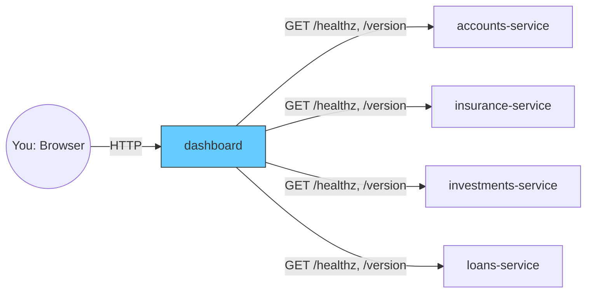

# Module 0: Course Introduction

**Duration:** ~15-20 min (orientation — not counted in the course's technical hours)
**Environment:** None — just read
**Prerequisites:** None yet — this module tells you what you'll need before Module 2

---

## What You'll Build

Across this course you'll deploy, break, roll back, and promote **Finoxa** — a
small demo fintech app — a personal finance dashboard. It's not a production
app with a real database; it exists so every GitOps concept in this course
has something concrete and visual to happen to.

Finoxa is 5 tiny microservices:

| Service | Language | What it does |
|---|---|---|
| `dashboard` | Node.js | Renders a dark-themed page with one tile per backend service |
| `accounts-service` | Node.js | Sample balance + transactions |
| `insurance-service` | Node.js | Sample insurance policies |
| `investments-service` | Python (FastAPI) | Sample investment portfolio |
| `loans-service` | Python (FastAPI) | Sample loan balance |

The dashboard polls each backend's `/healthz` and `/version` endpoint every
few seconds. A tile whose service isn't deployed yet doesn't error or
disappear — it renders greyed-out with **"Coming Soon"**. That one design
choice is what makes every exercise in this course visible on screen: sync a
new Application, watch a tile light up; roll back a bad release, watch a tile
grey out again.

### Architecture

Every arrow out of `dashboard` is independent — each backend can be deployed,
broken, rolled back, or removed entirely without touching the others or the
dashboard's own code. That independence is what makes Finoxa useful for
practicing GitOps on: every operation you perform targets one Kubernetes
Deployment/Service pair, with an immediate, visible effect on exactly one
tile.

### The version story

Finoxa ships four whole-app releases, each unlocking exactly one more tile:

| Version | Unlocks |
|---|---|
| `1.0.0` | Accounts |
| `2.0.0` | + Insurance |
| `3.0.0` | + Investments |
| `4.0.0` | + Loans |

Every image is already built and published for you on Docker Hub as
`arsr319/finoxa-<service>:<version>` — for example
`arsr319/finoxa-dashboard:2.0.0`. **You never need to build anything
yourself** until Module 6 (CI with GitHub Actions), where you'll finally look
under the hood at how those images got there. Until then, every lab just
points ArgoCD at a pre-built image tag.

---

## Who This Course Is For

DevOps engineers and developers who already know the basics of Kubernetes
(Pods, Deployments, Services) and Git, and want hands-on, practical GitOps
skills — not a certification-style tour of every ArgoCD feature. If you've
never used `kubectl` or committed to a Git repo before, do that first.

## Prerequisites

- Docker Desktop (or Docker Engine on Linux)
- Basic familiarity with Kubernetes (Pods, Deployments) and Git — Module 1
  assumes you know what these are, not how to master them
- A GitHub account (free) — you'll fork the [Finoxa GitOps repo](https://github.com/finoxa-argocd/gitops)
  in Module 3 to practice the GitOps commit loop yourself
- Nothing else yet — Module 2 walks you through installing `kind`, `kubectl`,
  `helm`, and ArgoCD itself from scratch

---

## A Two-Sentence Preview of GitOps & ArgoCD

**GitOps** means Git is the single source of truth for what should be
running, and an agent *inside* your cluster continuously pulls and applies
that state — nothing outside the cluster ever pushes into it. **ArgoCD** is
that agent: a Kubernetes controller that watches a Git repo (like the Finoxa
GitOps repo you'll fork) and keeps your cluster in sync with it. Module 1 covers
both in full depth — this is just enough to orient you.

## Where ArgoCD Fits in CI/CD

Your CI pipeline (GitHub Actions, in this course) builds, tests, and pushes
container images — it never touches your cluster. ArgoCD does the other
half: watching the manifests repo and deploying what it finds. Module 1
covers this split with a full diagram.

---

## Meet Your Instructor

_[Add 2–3 sentences here: your background, why you teach this, and what
makes your take on ArgoCD practical rather than theoretical.]_

## Resources, Course Repo & Getting Help

- **Course repo (app code, Dockerfiles + these module docs):** https://github.com/finoxa-argocd/finoxa-app
- **GitOps repo (Kubernetes manifests + Application definitions — this is the one you'll fork):** https://github.com/finoxa-argocd/gitops
- **Pre-built images:** [hub.docker.com/u/arsr319](https://hub.docker.com/u/arsr319) — every `finoxa-*` image referenced in this course
- **Questions during the course:** _[Udemy Q&A / Discord / email — fill in your preferred support channel]_

---

## What's Next

**Module 1: Why GitOps, Why ArgoCD** — no lab, just the problem GitOps
solves and where ArgoCD fits, in depth.
