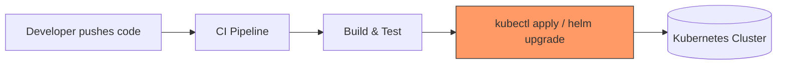
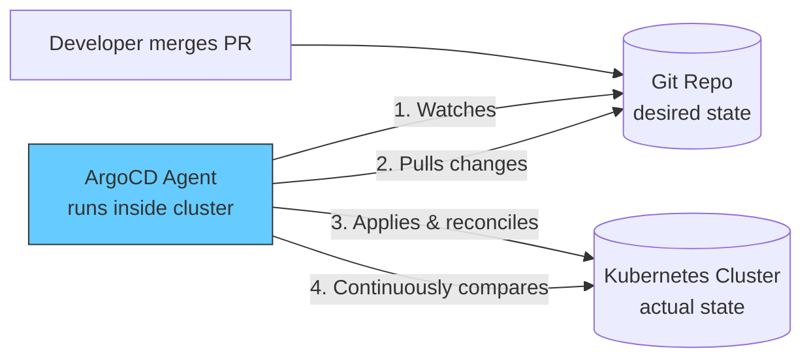
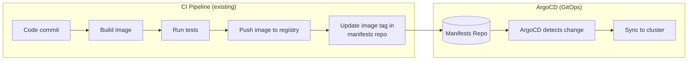

# Module 1: Why GitOps, Why ArgoCD

**Environment:** None (discussion only — no lab this module)
**Prerequisites:** Module 0 complete; basic familiarity with Kubernetes (Pods, Deployments) and Git

---

## Learning Objectives

By the end of this module, you should be able to:
- Explain why traditional push-based CI/CD creates problems at scale
- Define GitOps and its four core principles
- Explain the difference between push-based and pull-based deployment
- Describe where ArgoCD fits between your CI pipeline and your cluster

---

## 1. The Problem with Traditional (Push-Based) CI/CD

In a typical CI/CD setup, your pipeline (Jenkins, GitHub Actions, GitLab CI, etc.) does everything — it builds your code, runs tests, and then **pushes** the result straight into your Kubernetes cluster using `kubectl apply` or `helm upgrade`.



This works fine for small teams, but it breaks down as you scale. Here's why:

| Problem | Why it hurts |
|---|---|
| **Credential sprawl** | Every pipeline that deploys needs cluster-admin (or close to it) credentials. More pipelines = more places your cluster credentials are stored and can leak. |
| **No single source of truth** | What's actually *running* in the cluster can silently drift from what's in Git — nobody notices until something breaks. |
| **Undetected drift** | An engineer runs `kubectl edit` directly on the cluster during an incident. That change is now invisible to Git and to your team. |
| **Weak audit trail** | "Who deployed this and when?" means digging through CI logs across multiple pipelines, not a single readable history. |
| **Manual rollback** | Rolling back means re-running an old pipeline job and hoping it still works, not a clean, auditable action. |

---

## 2. Enter GitOps — the Pull-Based Model

**GitOps** is an operational model where:
- **Git is the single source of truth** for what your infrastructure and applications should look like
- An **automated agent running inside the cluster** (not your CI pipeline) continuously watches Git and **pulls** changes in — rather than something outside the cluster pushing changes to it

The [OpenGitOps](https://opengitops.dev/) project defines four core principles. These are worth memorizing — you'll see them referenced constantly in ArgoCD docs and interviews:

1. **Declarative** — the desired system state is expressed declaratively (YAML manifests, Helm charts, Kustomize), not as a sequence of imperative commands
2. **Versioned & Immutable** — desired state is stored in a way that enforces immutability and versioning (i.e., Git), giving you full history
3. **Pulled Automatically** — software agents automatically pull the desired state from Git — nothing pushes *into* the cluster from outside
4. **Continuously Reconciled** — agents continuously observe actual state vs. desired state and act to correct any divergence



---

## 3. Why "Pull" Beats "Push" for Security and Reliability

| Push-based CI/CD | Pull-based GitOps |
|---|---|
| CI pipeline holds cluster credentials | Agent lives *inside* the cluster — no external system holds cluster-admin credentials |
| Drift goes unnoticed until someone looks | Drift is detected automatically, continuously |
| Rollback = re-run an old pipeline job | Rollback = `git revert` (or a few clicks) |
| Audit trail = scattered CI logs | Audit trail = your Git history |
| Each new cluster needs new pipeline credentials wired up | Same Git repo can be reconciled into many clusters consistently |

This is the core security argument you'll hear for GitOps: **nothing outside the cluster needs write access to the cluster.** The agent inside pulls; nothing pushes in.

---

## 4. Where ArgoCD Fits in the Bigger Picture

A common point of confusion for people new to GitOps: **ArgoCD does not build or test your code.** That's still your CI pipeline's job. ArgoCD only handles the "get it running on the cluster" half.



**The split:**
- **CI** (GitHub Actions, in this course — covered in the Capstone project): builds, tests, pushes container images, and updates a manifests repo with the new image tag
- **CD** (ArgoCD): watches that manifests repo and reconciles the cluster to match it

This separation is deliberate — it means your CI system never needs cluster credentials at all.

---

## 5. What ArgoCD Actually Is

In one sentence:

> **ArgoCD is a Kubernetes controller that runs inside your cluster, continuously watches one or more Git repositories, and keeps your cluster's actual state in sync with what's declared in Git.**

It's not a CI tool, not a build tool, and not a general-purpose automation tool — it does one job (continuous reconciliation) and does it well, with a UI, CLI, and API layered on top for visibility and control.

---

## 6. A Realistic Example Walkthrough

Say your team wants to ship a new release of Finovra's `dashboard` — the app you met in Module 0. Here's what actually happens end to end:

1. A developer merges a PR that updates the image tag in the manifests repo:

```yaml
# Before (in Git)
spec:
  containers:
    - name: dashboard
      image: arsr319/finovra-dashboard:1.0.0
```

```yaml
# After (in Git, via merged PR)
spec:
  containers:
    - name: dashboard
      image: arsr319/finovra-dashboard:2.0.0
```

2. ArgoCD's reconciliation loop (running inside the cluster) notices the Git state no longer matches the cluster's live state
3. ArgoCD pulls the new manifest and applies it — no one ran `kubectl apply` by hand, and no CI pipeline touched the cluster directly
4. The new Pod rolls out, and ArgoCD's UI shows the sync status and health of the change
5. If something goes wrong, the fix is a `git revert` on that same PR — not a scramble through pipeline logs (we'll cover this in depth in Module 5)

You'll do exactly this — for real, against your own fork — starting in Module 3.

---

## Key Terms Glossary

| Term | Meaning |
|---|---|
| **Desired state** | What's declared in Git — what *should* be running |
| **Actual (live) state** | What's *actually* running in the cluster right now |
| **Reconciliation loop** | The continuous process of comparing desired vs. actual state and correcting differences |
| **Drift** | Any difference between desired state (Git) and actual state (cluster) |
| **Sync** | The act of applying Git's desired state to the cluster |
| **Application** | ArgoCD's core resource representing "this Git source, deployed to this cluster/namespace" (we'll build our first one in Module 3, deploying Finovra) |

---

## Recap Questions

Try answering these before moving to Module 2 — no need to write anything down, just make sure you can explain each one out loud:

1. In a push-based pipeline, where do cluster credentials typically live — and why is that a security concern?
2. What are the four OpenGitOps principles, and can you explain each one in your own words?
3. If someone runs `kubectl edit` directly on a cluster managed by ArgoCD, what happens next?
4. Why doesn't ArgoCD need your CI pipeline to have cluster-admin credentials?
5. In the CI/CD split diagram, which half is ArgoCD responsible for — and which half is it explicitly *not* responsible for?

---

## What's Next

In **Module 2**, we'll get hands-on: installing Docker and kind, spinning up a local Kubernetes cluster, and installing ArgoCD itself so we have a real environment to work in for the rest of the course.
