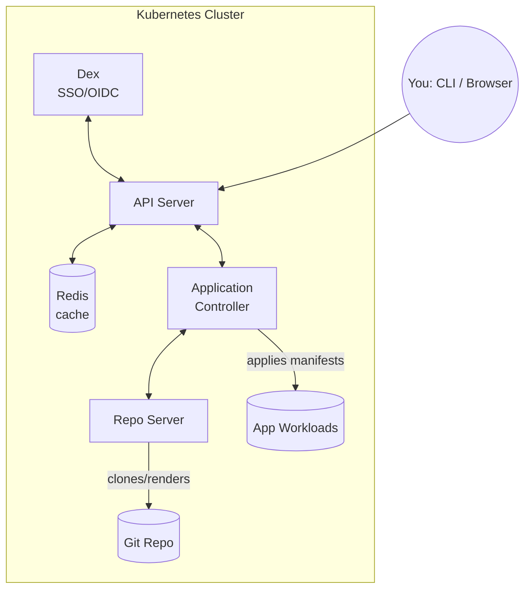

# Module 2: Installation & Architecture

**Duration:** 1 hr
**Environment:** `kind` (local)
**Prerequisites:** Docker installed and running; Module 1 concepts

---

## Learning Objectives

By the end of this module, you should be able to:
- Explain ArgoCD's core components and what each one does
- Spin up a local Kubernetes cluster using kind
- Install ArgoCD into that cluster via Helm
- Log in via both the CLI and the Web UI

---

## 1. ArgoCD's Core Components

ArgoCD isn't a single binary — it's a set of controllers and services that work together, all running as Pods inside your cluster.



| Component | What it does |
|---|---|
| **API Server** | The gRPC/REST server the CLI and UI talk to. Handles auth, RBAC, and exposes Application data. |
| **Repo Server** | Clones your Git repos and renders manifests (runs `helm template`, `kustomize build`, etc. internally). Never touches the live cluster directly. |
| **Application Controller** | The reconciliation loop itself — continuously compares live cluster state to what the Repo Server rendered from Git, and triggers syncs. |
| **Redis** | Caching layer — stores rendered manifests and cluster state to avoid re-computing on every reconciliation tick. |
| **Dex** (optional) | Handles SSO/OIDC login (GitHub, Google, LDAP, etc.) — covered at concept level in the optional Running ArgoCD Safely module. |

**Key insight:** notice that only the **Application Controller** talks to your actual workloads. The Repo Server only ever talks to Git — it has no cluster-write access. This separation is part of why ArgoCD's architecture is considered secure by design.

---

## 2. Installing Docker, kind, kubectl & Helm

### 2.1 Install Docker
ArgoCD itself doesn't need Docker directly, but **kind** (Kubernetes-in-Docker) uses Docker to run cluster "nodes" as containers.

- **Mac:** [Docker Desktop](https://www.docker.com/products/docker-desktop/)
- **Windows:** [Docker Desktop](https://www.docker.com/products/docker-desktop/) (with WSL2 backend)
- **Linux:** [Docker Engine](https://docs.docker.com/engine/install/)

Verify it's running:

```bash
docker version
```

### 2.2 Install kind

```bash
# macOS (Homebrew)
brew install kind

# Linux
curl -Lo ./kind https://kind.sigs.k8s.io/dl/latest/kind-linux-amd64
chmod +x ./kind
sudo mv ./kind /usr/local/bin/kind

# Windows (Chocolatey)
choco install kind
```

Verify:

```bash
kind version
```

### 2.3 Install kubectl

```bash
# macOS
brew install kubectl

# Linux
curl -LO "https://dl.k8s.io/release/$(curl -L -s https://dl.k8s.io/release/stable.txt)/bin/linux/amd64/kubectl"
chmod +x kubectl
sudo mv kubectl /usr/local/bin/

# Windows (Chocolatey)
choco install kubernetes-cli
```

Verify:

```bash
kubectl version --client
```

### 2.4 Install Helm

We'll use this in Section 4 to install ArgoCD itself.

```bash
# macOS
brew install helm

# Linux
curl https://raw.githubusercontent.com/helm/helm/main/scripts/get-helm-3 | bash

# Windows (Chocolatey)
choco install kubernetes-helm
```

Verify:

```bash
helm version
```

---

## 3. Creating Our Course Cluster

Rather than using kind's bare defaults, we'll use a small config file — this makes our cluster reproducible and lets us name it clearly, which matters once you have multiple clusters around (we'll need a second one in Module 9).

Create a file called `kind-config.yaml`:

```yaml
# kind-config.yaml
kind: Cluster
apiVersion: kind.x-k8s.io/v1alpha4
name: argocd-course
nodes:
  - role: control-plane
  - role: worker
```

Create the cluster:

```bash
kind create cluster --config kind-config.yaml
```

This takes about 30-40 seconds. Verify it's up:

```bash
kubectl cluster-info --context kind-argocd-course
kubectl get nodes
```

You should see one `control-plane` node and one `worker` node, both `Ready`.

> **Tip:** if you ever get your cluster into a messy state while practicing, you can wipe it and start fresh in under a minute — don't hesitate to do this if something feels broken and you're not sure why:
> ```bash
> kind delete cluster --name argocd-course
> kind create cluster --config kind-config.yaml
> ```

---

## 4. Installing ArgoCD via Helm

### 4.1 Add the Argo Helm repo

```bash
helm repo add argo https://argoproj.github.io/argo-helm
helm repo update
```

### 4.2 Create a namespace and install

```bash
kubectl create namespace argocd

helm install argocd argo/argo-cd \
  --namespace argocd \
  --version 10.3.2 \
  --timeout 10m
```

> We're pinning a specific chart version (`10.3.2`, App Version `v3.5.0`) rather than using `latest` — this keeps what you see on your screen consistent with the videos, no matter when you're following along. Once you've finished the course, feel free to check the [Argo Helm chart releases](https://github.com/argoproj/argo-helm/releases) and install a newer version to explore what's changed.
>
> **Why `--timeout 10m`:** Helm's default install timeout is 5 minutes, and it waits on the `argocd-redis-secret-init` pre-install hook Job before it'll proceed. On a cold Docker cache, pulling `quay.io/argoproj/argocd:v3.5.0` for the first time can take longer than that — the pull itself isn't stuck, Helm just gives up waiting and reports `INSTALLATION FAILED: ... context deadline exceeded`. If you hit this anyway, it's safe to `helm uninstall argocd -n argocd` and re-run the install — the image is cached on the node now, so the retry will be fast.

### 4.3 Watch it come up

```bash
kubectl get pods -n argocd -w
```

Wait until all pods show `Running` (usually under a minute). Press `Ctrl+C` once they're all up.

You should see pods like:
```
argocd-application-controller-0
argocd-applicationset-controller-...
argocd-dex-server-...
argocd-notifications-controller-...
argocd-redis-...
argocd-repo-server-...
argocd-server-...
```

This maps directly to the architecture diagram from Section 1 — you're now looking at the real components running as Pods.

---

## 5. Accessing ArgoCD

### 5.1 Port-forward the API server / UI

```bash
kubectl port-forward svc/argocd-server -n argocd 8080:443
```

Leave this running in a terminal, then open **https://localhost:8080** in your browser. (You'll get a self-signed cert warning — that's expected for local dev, just proceed.)

### 5.2 Get the initial admin password

Helm auto-generates an admin password on first install, stored in a Secret:

```bash
kubectl -n argocd get secret argocd-initial-admin-secret \
  -o jsonpath="{.data.password}" | base64 -d
```

Log in to the UI with:
- **Username:** `admin`
- **Password:** *(output from the command above)*

### 5.3 Install the ArgoCD CLI

```bash
# macOS
brew install argocd

# Linux
curl -sSL -o argocd-linux-amd64 https://github.com/argoproj/argo-cd/releases/latest/download/argocd-linux-amd64
sudo install -m 555 argocd-linux-amd64 /usr/local/bin/argocd
rm argocd-linux-amd64

# Windows (Chocolatey)
choco install argocd-cli
```

### 5.4 Log in via CLI

The most reliable way to use the ArgoCD CLI locally is to have it manage its own port-forward per command, rather than relying on a separate long-lived `kubectl port-forward` process (which can be flaky on some machines/networks). Add this alias:

```bash
echo 'alias argocd="argocd --port-forward --port-forward-namespace argocd"' >> ~/.zshrc
source ~/.zshrc
```

*(If you're using bash instead of zsh, add it to `~/.bashrc` instead.)*

Now log in — you don't even need the manual `kubectl port-forward` from Section 5.1 running for this to work, since the alias handles it for you automatically:

```bash
argocd login localhost:8080 \
  --username admin \
  --password <paste-password-here> \
  --insecure
```

`--insecure` is fine here because we're on a self-signed local cert — never use this flag against a real production ArgoCD instance.

> **⚠️ Noise you may see:** every command run through the `argocd` alias (Section 5.4) opens its own ephemeral port-forward and tears it down when the command finishes. That teardown often logs a JSON blob like `{"error":"error copying from remote stream to local connection: ... broken pipe", ...}` to stderr. This is a known cosmetic race in the CLI's port-forward cleanup — it does **not** mean the command failed. Check the actual output: `'admin:login' logged in successfully` (or the real table from `cluster list`) means it worked, regardless of what printed above it.

Verify the CLI is talking to your instance:

```bash
argocd version
argocd cluster list
```

You should see your `in-cluster` target listed — this is the cluster ArgoCD itself is running in, which is also where we'll deploy Finovra.

---

## Lab: Full Setup Walkthrough

1. Install Docker, kind, kubectl, and Helm (Section 2 above)
2. Create `kind-config.yaml` as shown above and run `kind create cluster --config kind-config.yaml`
3. Install ArgoCD via Helm into the `argocd` namespace
4. Port-forward the ArgoCD server and log in via the browser UI
5. Install the ArgoCD CLI and log in via `argocd login`
6. Run `argocd cluster list` and confirm you see the in-cluster target

**Checkpoint:** you should be able to see the (currently empty) ArgoCD UI dashboard, and `argocd app list` should return an empty list with no errors — that confirms both CLI and UI are correctly talking to your ArgoCD instance.

---

## Key Terms Glossary

| Term | Meaning |
|---|---|
| **kind** | "Kubernetes IN Docker" — runs Kubernetes nodes as Docker containers, ideal for local dev/CI |
| **Helm chart** | A packaged, templated set of Kubernetes manifests — how we're installing ArgoCD itself |
| **Repo Server** | ArgoCD component that clones Git and renders manifests, with no cluster-write access |
| **Application Controller** | ArgoCD component that runs the reconciliation loop against the live cluster |
| **Port-forward** | A `kubectl` feature that tunnels a local port to a Service inside the cluster — how we're reaching the UI without an Ingress/LoadBalancer |

---

## Recap Questions

1. Which ArgoCD component actually applies changes to your cluster — and which one never touches the cluster at all?
2. Why did we pin a specific Helm chart version instead of installing `latest`?
3. What's the difference between what `kubectl port-forward` gives us here versus a `LoadBalancer` Service (which we'll use later on EKS)?
4. Where does ArgoCD's initial admin password come from, and how did we retrieve it?
5. If you ran `kind delete cluster --name argocd-course` right now, what would you need to redo to get back to where we are at the end of this module?

---

## What's Next

In **Module 3**, we'll deploy our first real `Application` — **Finovra**, the fintech dashboard from Module 0 — and walk through manual sync, automated sync, and reading ArgoCD's health/sync status.
