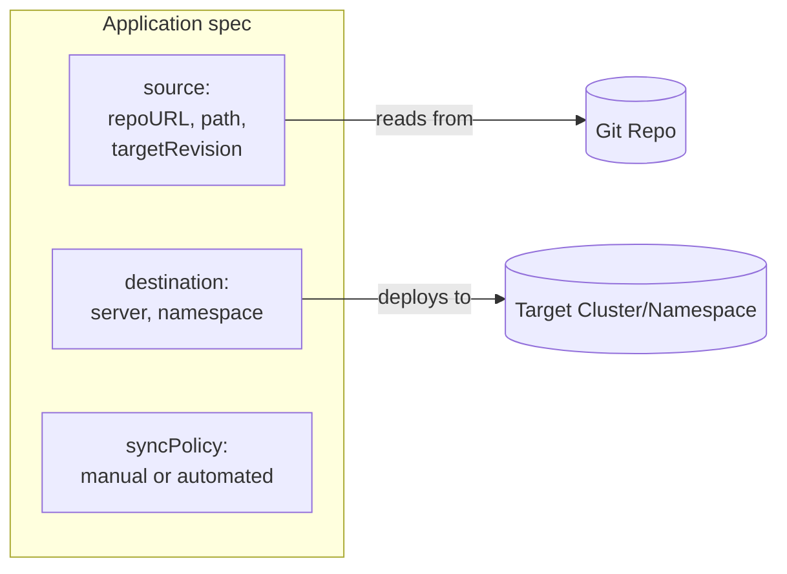
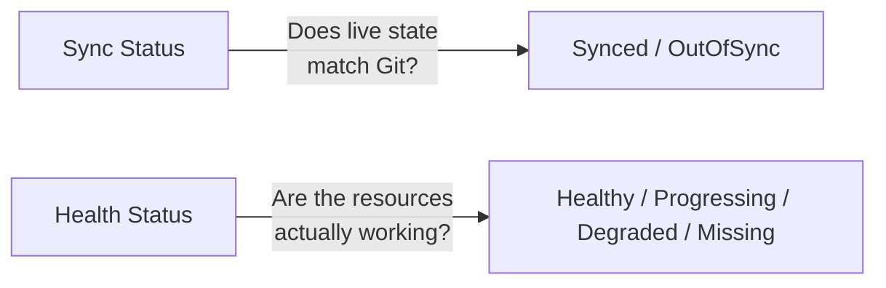

# Module 3: Your First Application

**Duration:** 1.5 hrs
**Environment:** `kind` (local)
**Prerequisites:** Module 2 complete — ArgoCD installed and you're logged in via both UI and CLI

---

## Learning Objectives

By the end of this module, you should be able to:
- Explain every field in an ArgoCD `Application` resource
- Deploy Finoxa into your cluster through ArgoCD
- Understand the difference between manual and automated sync
- Explain what Prune and Self-Heal actually do
- Read an application's sync status and health status correctly

---

## About Our Demo App: Finoxa

You met Finoxa in Module 0: a small fake fintech dashboard where each backend
"product" (accounts, insurance, investments, loans) shows up as a tile. It
ships as four whole-app releases — `1.0.0` through `4.0.0` — each unlocking
exactly one more tile. In this module we deploy **v1.0.0**: just `dashboard`
and `accounts-service`. The other three tiles will render greyed-out
"Coming Soon" — not because we configured anything special, but because
their Kubernetes manifests simply don't exist in the repo yet. We'll add them
in later modules, the same way a real team ships features incrementally.

> **System requirements:** unlike an 11-service app, this needs almost
> nothing — two Pods, ~200m CPU and ~256Mi RAM combined. No resource-saving
> tricks needed this module.

---

## 1. The `Application` Resource — ArgoCD's Core Building Block

Everything in ArgoCD revolves around one Kubernetes custom resource: the `Application`. It answers three questions:
1. **Where's the source?** (which Git repo, which path, which branch)
2. **Where's the destination?** (which cluster, which namespace)
3. **How should it behave?** (sync policy, pruning, self-healing)



Here's a minimal, fully commented example using Finoxa:

```yaml
apiVersion: argoproj.io/v1alpha1
kind: Application
metadata:
  name: finoxa               # This is the name you'll see in the UI/CLI
  namespace: argocd          # Applications always live in the argocd namespace itself
spec:
  project: default           # Which AppProject this belongs to (default for now — Module 10 covers custom projects)
  source:
    repoURL: https://github.com/finoxa-argocd/finoxa-app.git
    targetRevision: main     # Branch, tag, or commit SHA to track
    path: k8s/plain-manifests
    directory:
      recurse: true          # Pick up every service folder under this path
  destination:
    server: https://kubernetes.default.svc   # "This same cluster" — ArgoCD's own cluster
    namespace: finoxa        # Namespace to deploy into
  syncPolicy:
    syncOptions:
      - CreateNamespace=true # Let ArgoCD create the namespace if it doesn't exist
```

A few things worth noticing:
- `destination.server: https://kubernetes.default.svc` is a special value meaning "the cluster ArgoCD itself is running in" — you'll use a different value here once we add a second cluster in Module 11
- `source.path: k8s/plain-manifests` points at a folder containing **one subfolder per service** (`dashboard/`, `accounts-service/`, and later `insurance-service/`, `investments-service/`, `loans-service/` as we add them), each holding a `deployment.yaml` and `service.yaml`
- `directory.recurse: true` tells ArgoCD to walk into those subfolders rather than stopping at the top level. Without it, ArgoCD would find zero YAML files directly in `k8s/plain-manifests/` and deploy nothing
- `CreateNamespace=true` is a small but handy sync option — without it, ArgoCD would fail to sync into a namespace that doesn't exist yet

---

## 2. Manual Sync vs. Automated Sync

**Manual sync** — you (or a pipeline) explicitly click "Sync" or run `argocd app sync`. ArgoCD detects drift and shows it to you, but waits for a human (or explicit automation) to say "go."

**Automated sync** — ArgoCD reconciles automatically the moment it detects Git has changed, with no human action needed:

```yaml
spec:
  syncPolicy:
    automated: {}
```

| | Manual | Automated |
|---|---|---|
| Good for | Production environments where you want a deliberate approval step | Dev/staging environments, or teams confident in their CI checks |
| Speed | Slower — someone has to notice and click | Fast — changes land within seconds of a Git push |
| Risk | Lower — nothing changes without a human looking at it | Higher — a bad commit deploys immediately unless caught by CI first |

Most real teams run **automated sync in dev/staging** and either **automated with strict CI gating** or **manual approval** in production — we'll build exactly this pattern in Module 9 (Promotion).

---

## 3. Prune and Self-Heal — Two Settings You'll Use Constantly

These live inside `syncPolicy.automated` and are easy to mix up:

```yaml
spec:
  syncPolicy:
    automated:
      prune: true      # Delete resources that were removed from Git
      selfHeal: true    # Revert manual cluster changes back to match Git
```

- **`prune: true`** — if you delete a resource's YAML from Git, ArgoCD will delete that resource from the cluster too. Without this, deleted-from-Git resources just sit there forever ("orphaned").
- **`selfHeal: true`** — if someone runs `kubectl edit` or `kubectl delete` directly against a resource ArgoCD manages, ArgoCD will notice the drift and revert it back to match Git automatically. This is GitOps's "continuously reconciled" principle in action (from Module 1).

Both default to `false` if omitted — ArgoCD deliberately doesn't enable these unless you ask for them, since prune/self-heal are powerful (and a little scary the first time you see them delete something you just manually created).

---

## 4. Reading Status: Sync State vs. Health State

ArgoCD tracks **two independent statuses** for every application — this trips people up constantly, so it's worth being precise:



| Status type | Answers | Possible values |
|---|---|---|
| **Sync Status** | "Does what's running match what's in Git?" | `Synced`, `OutOfSync`, `Unknown` |
| **Health Status** | "Are the running resources actually healthy?" | `Healthy`, `Progressing`, `Degraded`, `Missing`, `Unknown` |

**An application can be `Synced` and still `Degraded`** — Git and the cluster agree on what *should* be running, but a Pod is crash-looping. That's a completely valid (if unfortunate) state, and knowing this distinction will save you a lot of confusion when debugging later modules, especially Module 7 (rollbacks).

---

## Lab: Deploy Finoxa v1.0.0

### Step 1 — Create the Application (declarative approach)

Save this as `finoxa-app.yaml`:

```yaml
apiVersion: argoproj.io/v1alpha1
kind: Application
metadata:
  name: finoxa
  namespace: argocd
spec:
  project: default
  source:
    repoURL: https://github.com/finoxa-argocd/finoxa-app.git
    targetRevision: main
    path: k8s/plain-manifests
    directory:
      recurse: true
  destination:
    server: https://kubernetes.default.svc
    namespace: finoxa
  syncPolicy:
    syncOptions:
      - CreateNamespace=true
```

Apply it:

```bash
kubectl apply -f finoxa-app.yaml
```

### Step 2 — Confirm it shows up (but isn't deployed yet)

```bash
argocd app get finoxa
```

You should see `Sync Status: OutOfSync` and `Health Status: Missing` — the Application exists, but since we haven't enabled `automated` sync, nothing has touched the cluster yet.

You can also see this in the UI: open **https://localhost:8080**, and you should see a new `finoxa` tile, shown in yellow/orange (OutOfSync).

### Step 3 — Manually sync it

Via CLI:

```bash
argocd app sync finoxa
```

Or via UI: click into the `finoxa` application and click **Sync → Synchronize**.

You should see 5 resources get created: the `finoxa` Namespace, two Services, and two Deployments (`dashboard`, `accounts-service`).

### Step 4 — Watch it become healthy

```bash
argocd app get finoxa
kubectl get pods -n finoxa
```

Wait until `Health Status: Healthy` and both Pods show `1/1 Running` — this takes seconds, not minutes, since we're only pulling two small images. In the UI, click into the application to see the **resource tree**: the Namespace, both Services, both Deployments, and their Pods, all green.

### Step 5 — See the app in your browser

```bash
kubectl port-forward svc/dashboard -n finoxa 8082:3000
```

Open **http://localhost:8082** — you should see the Finoxa header (v1.0.0) and **four tiles**: 💰 Accounts in green (`ok`), and Insurance/Investments/Loans greyed out with **"Coming Soon"**. That's expected — their manifests don't exist in `k8s/plain-manifests/` yet, so ArgoCD never created them, and the dashboard's `SERVICES` config lists all four regardless of what's actually deployed.

> **Note:** unlike a Loadgenerator-style component, Finoxa has nothing to scale down here — both Pods together use about 200m CPU and 256Mi RAM. No resource-saving step needed this module.

### Step 6 — Enable automated sync with prune and self-heal

Edit `finoxa-app.yaml`:

```yaml
spec:
  syncPolicy:
    automated:
      prune: true
      selfHeal: true
    syncOptions:
      - CreateNamespace=true
```

Reapply:

```bash
kubectl apply -f finoxa-app.yaml
```

**Checkpoint:** `argocd app get finoxa` should show `Sync Status: Synced` and `Health Status: Healthy`, and the UI resource tree should show every resource green.

### Step 7 — Preview of Module 4: try to break it

With self-heal on, try scaling `accounts-service` up by hand:

```bash
kubectl scale deployment accounts-service -n finoxa --replicas=3
kubectl get deployment accounts-service -n finoxa -w
```

Within a few seconds, ArgoCD notices the live replica count (3) no longer matches Git (`replicas: 1`, explicitly set in `deployment.yaml`) and scales it back down — without you doing anything. Press `Ctrl+C` once it settles back at `1/1`. We'll dig into exactly why this happened, and how to make a change that's supposed to stick, in Module 4.

> **💡 Debugging tip: trust the live object, not your local file.** A very common source of confusion: you edit `finoxa-app.yaml` locally, but forget you already `kubectl apply`'d an earlier version — or you applied a change, then kept editing the file afterward without reapplying it. The file on your disk and the actual `Application` object running in the cluster can silently drift apart, and only one of them is actually in control. If ArgoCD is doing something you don't expect (like reverting a change you just made), always check what's *actually* running before assuming your local file is accurate:
> ```bash
> kubectl get application finoxa -n argocd -o yaml | grep -A5 "^  syncPolicy"
> ```
> This shows the real, live spec — independent of whatever your editor currently has open. It's one of the most useful single commands for debugging "why is ArgoCD doing this" questions throughout the rest of this course.

---

## Key Terms Glossary

| Term | Meaning |
|---|---|
| **Application** | ArgoCD's core CRD — represents one deployable unit: a Git source + a destination + a sync policy |
| **AppProject** | A grouping/permissions boundary for Applications (default for now, covered properly in Module 10) |
| **Sync Status** | Whether live cluster state matches Git (`Synced` / `OutOfSync`) |
| **Health Status** | Whether the deployed resources are actually working (`Healthy` / `Degraded` / etc.) |
| **Prune** | Deletes cluster resources that were removed from Git |
| **Self-Heal** | Reverts manual cluster changes back to match Git automatically |
| **Resource tree** | The UI view showing every Kubernetes resource an Application owns and their relationships |
| **`directory.recurse`** | Tells ArgoCD's directory source to walk into subfolders instead of only reading files at the top level of `source.path` |

---

## Recap Questions

1. What are the three things every `Application` resource must define?
2. If `syncPolicy.automated` is left out entirely, what happens when you push a change to Git — does anything deploy automatically?
3. Can an application be `Synced` and `Degraded` at the same time? Why or why not?
4. What's the difference between what `prune: true` does versus what `selfHeal: true` does?
5. In Step 7 of the lab, why did scaling `accounts-service` up with `kubectl` get reverted once self-heal was enabled — and what would you need to do differently to make that change stick?
6. Why do Insurance, Investments, and Loans show "Coming Soon" instead of erroring or crashing the Application's health status?

---

## What's Next

In **Module 4**, we'll deliberately cause drift again — this time digging into *why* it gets reverted — and then make a change that's supposed to stick: adding `insurance-service` to the repo and watching Finoxa go from v1.0.0 to v2.0.0 with zero manual `kubectl` involvement.
