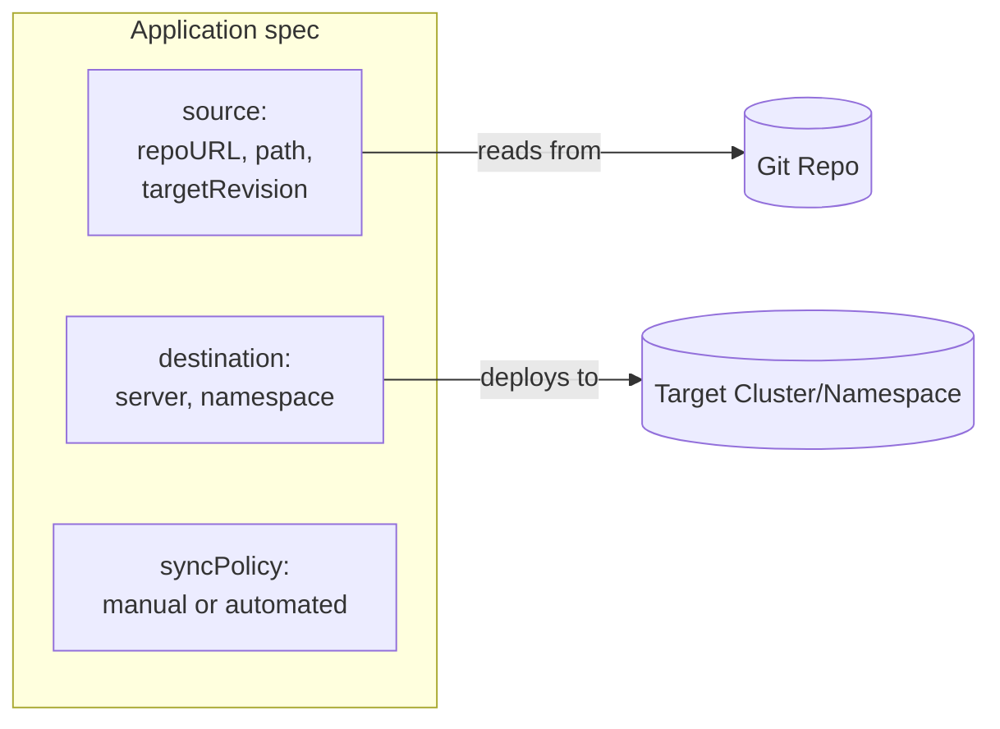
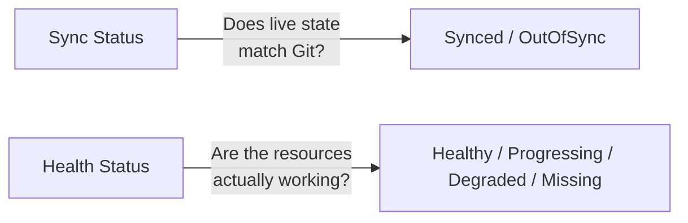

# Module 3: Your First Application

**Duration:** 1.5 hrs
**Environment:** `kind` (local)
**Prerequisites:** Module 2 complete — ArgoCD installed and you're logged in via both UI and CLI

---

## Learning Objectives

By the end of this module, you should be able to:
- Explain every field in an ArgoCD `Application` resource
- Deploy Finovra into your cluster through ArgoCD
- Understand the difference between manual and automated sync
- Explain what Prune and Self-Heal actually do, and demonstrate each in isolation
- Read an application's sync status and health status correctly
- Navigate the ArgoCD UI: resource tree, Pod logs, Diff, Sync panel, History and Rollback

---

## About Our Demo App: Finovra

You met Finovra in Module 0: a small demo fintech app where each backend
"product" (accounts, insurance, investments, loans) shows up as a tile. In
this module we deploy **v1.0.0**: `dashboard` and all four backend services,
together, in one Application. Every tile shows real, live data from the
moment the sync completes — there's no "unlock one service per module" story
here. Later modules bump the **dashboard's** version as it gains real
features; the backends stay exactly as they are today.

> **System requirements:** five small Pods, ~250m CPU and ~320Mi RAM combined
> (requests). No resource-saving tricks needed this module.

### Two Repos: App Code vs. GitOps Config

Finovra actually lives across two GitHub repos, and it's worth knowing why before we deploy anything:

| Repo | Holds | Changes when... | You'll edit it starting... |
|---|---|---|---|
| [`finovra-app/webapp`](https://github.com/finovra-app/webapp) | Service source code, Dockerfiles | The application itself changes | Module 5 (CI) |
| [`finovra-app/gitops`](https://github.com/finovra-app/gitops) | Kubernetes manifests, the `Application` resource | The *desired state of the cluster* changes | **This module** |

This is a standard "app repo vs. config repo" split used by most real GitOps
teams: an image build never has to touch a manifest, and a manifest edit
never has to touch application code. Everything you do for the rest of this
module — and every Git push in the labs going forward — happens in your fork
of **`gitops`**, not `webapp`.

**Fork it now:** open https://github.com/finovra-app/gitops and click
**Fork**. Then clone your fork locally — you'll be editing files in it
throughout this lab.

---

## 1. The `Application` Resource — ArgoCD's Core Building Block

Everything in ArgoCD revolves around one Kubernetes custom resource: the `Application`. It answers three questions:
1. **Where's the source?** (which Git repo, which path, which branch)
2. **Where's the destination?** (which cluster, which namespace)
3. **How should it behave?** (sync policy, pruning, self-healing)



Here's a minimal, fully commented example using Finovra:

```yaml
apiVersion: argoproj.io/v1alpha1
kind: Application
metadata:
  name: finovra               # This is the name you'll see in the UI/CLI
  namespace: argocd          # Applications always live in the argocd namespace itself
spec:
  project: default           # Which AppProject this belongs to (default for now — Module 9 covers custom projects)
  source:
    repoURL: https://github.com/finovra-app/gitops.git
    targetRevision: main     # Branch, tag, or commit SHA to track
    path: k8s/plain-manifests
    directory:
      recurse: true          # Pick up every service folder under this path
  destination:
    server: https://kubernetes.default.svc   # "This same cluster" — ArgoCD's own cluster
    namespace: finovra        # Namespace to deploy into
  syncPolicy:
    syncOptions:
      - CreateNamespace=true # Let ArgoCD create the namespace if it doesn't exist
```

A few things worth noticing:
- `destination.server: https://kubernetes.default.svc` is a special value meaning "the cluster ArgoCD itself is running in" — you'll use a different value here once we add a second cluster in Module 11
- `repoURL` points at the **`gitops`** repo, not `webapp` — see "Two Repos" above
- `source.path: k8s/plain-manifests` points at a folder containing **one subfolder per service** — `dashboard/`, `accounts-service/`, `insurance-service/`, `investments-service/`, `loans-service/`, all five already there — each holding a `deployment.yaml` and `service.yaml`
- `directory.recurse: true` tells ArgoCD to walk into those subfolders rather than stopping at the top level. Without it, ArgoCD would find zero YAML files directly in `k8s/plain-manifests/` and deploy nothing
- `CreateNamespace=true` is a small but handy sync option — without it, ArgoCD would fail to sync into a namespace that doesn't exist yet

---

## 2. Manual Sync vs. Automated Sync

**Manual sync** — you (or a pipeline) explicitly click "Sync" or run `argocd app sync`. ArgoCD detects drift and shows it to you, but waits for a human (or explicit automation) to say "go."

**Automated sync** — ArgoCD reconciles automatically the moment it detects Git has changed, with no human action needed:

```yaml
spec:
  syncPolicy:
    automated: {}
```

| | Manual | Automated |
|---|---|---|
| Good for | Production environments where you want a deliberate approval step | Dev/staging environments, or teams confident in their CI checks |
| Speed | Slower — someone has to notice and click | Fast — changes land within seconds of a Git push |
| Risk | Lower — nothing changes without a human looking at it | Higher — a bad commit deploys immediately unless caught by CI first |

Most real teams run **automated sync in dev/staging** and either **automated with strict CI gating** or **manual approval** in production — we'll build exactly this pattern in Module 8 (Promotion).

---

## 3. Prune and Self-Heal — Two Settings You'll Use Constantly

These live inside `syncPolicy.automated` and are easy to mix up:

```yaml
spec:
  syncPolicy:
    automated:
      prune: true      # Delete resources that were removed from Git
      selfHeal: true    # Revert manual cluster changes back to match Git
```

- **`prune: true`** — if you delete a resource's YAML from Git, ArgoCD will delete that resource from the cluster too. Without this, deleted-from-Git resources just sit there forever ("orphaned").
- **`selfHeal: true`** — if someone runs `kubectl edit` or `kubectl delete` directly against a resource ArgoCD manages, ArgoCD will notice the drift and revert it back to match Git automatically. This is GitOps's "continuously reconciled" principle in action (from Module 1).

Both default to `false` if omitted — ArgoCD deliberately doesn't enable these unless you ask for them, since prune/self-heal are powerful (and a little scary the first time you see them delete something you just manually created).

---

## 4. Reading Status: Sync State vs. Health State

ArgoCD tracks **two independent statuses** for every application — this trips people up constantly, so it's worth being precise:



| Status type | Answers | Possible values |
|---|---|---|
| **Sync Status** | "Does what's running match what's in Git?" | `Synced`, `OutOfSync`, `Unknown` |
| **Health Status** | "Are the running resources actually healthy?" | `Healthy`, `Progressing`, `Degraded`, `Missing`, `Unknown` |

**An application can be `Synced` and still `Degraded`** — Git and the cluster agree on what *should* be running, but a Pod is crash-looping. That's a completely valid (if unfortunate) state, and knowing this distinction will save you a lot of confusion when debugging later modules, especially Module 6 (rollbacks).

---

## Lab: Deploy Finovra v1.0.0

### Step 1 — Create the Application (declarative approach)

Save this as `finovra-app.yaml`. Replace `repoURL` with **your own fork** of
`gitops` (e.g. `https://github.com/<your-username>/gitops.git`) — this is
what makes Steps 6-8 later in this lab actually push-able:

```yaml
apiVersion: argoproj.io/v1alpha1
kind: Application
metadata:
  name: finovra
  namespace: argocd
spec:
  project: default
  source:
    repoURL: https://github.com/<your-username>/gitops.git
    targetRevision: main
    path: k8s/plain-manifests
    directory:
      recurse: true
  destination:
    server: https://kubernetes.default.svc
    namespace: finovra
  syncPolicy:
    syncOptions:
      - CreateNamespace=true
```

Apply it:

```bash
kubectl apply -f finovra-app.yaml
```

### Step 2 — Confirm it shows up (but isn't deployed yet)

```bash
argocd app get finovra
```

You should see `Sync Status: OutOfSync` and `Health Status: Missing` — the Application exists, but since we haven't enabled `automated` sync, nothing has touched the cluster yet.

You can also see this in the UI: open **https://localhost:8080**, and you should see a new `finovra` tile, shown in yellow/orange (OutOfSync).

### Step 3 — Manually sync it

Via CLI:

```bash
argocd app sync finovra
```

Or via UI: click into the `finovra` application and click **Sync → Synchronize**.

You should see 11 resources get created: the `finovra` Namespace, five Services, and five Deployments (`dashboard`, `accounts-service`, `insurance-service`, `investments-service`, `loans-service`).

### Step 4 — Watch it become healthy

```bash
argocd app get finovra
kubectl get pods -n finovra
```

Wait until `Health Status: Healthy` and all five Pods show `1/1 Running` — this takes well under a minute, since these are small images. In the UI, click into the application to see the **resource tree**: the Namespace, all five Services, all five Deployments, and their Pods, all green.

### Step 5 — See the app in your browser

```bash
kubectl port-forward svc/dashboard -n finovra 8082:3000
```

Open **http://localhost:8082** — you should see the Finovra header (v1.0.0) and **all four tiles green**: 💰 Accounts, 🛡️ Insurance, 📈 Investments, and 🏦 Loans, each showing `ok` and `v1.0.0`. No greyed-out tiles — that's the whole point of deploying all four backends together.

> **Note:** Finovra has nothing to scale down here — all five Pods together use about 250m CPU and 320Mi RAM. No resource-saving step needed this module.

---

## GUI Walkthrough: Navigating ArgoCD

Now that you have one real Application to look at, it's worth a proper tour of the UI before we start flipping sync policy settings — you'll be living in this screen for the rest of the course.

1. **Applications list** (https://localhost:8080) — one tile per Application. Each tile carries two *independent* indicators — don't confuse them:

   | Indicator | What it shows |
   |---|---|
   | Sync status icon | ✔ green = `Synced`, ⟳ orange = `OutOfSync` |
   | Health status color | Green heart = `Healthy`, blue spinner = `Progressing`, red heart = `Degraded`, grey = `Unknown`/`Missing` |

2. **Click the `finovra` tile → resource tree.** This is the actual object graph ArgoCD created: the Application node at top, flowing down to the Namespace, Deployments, the ReplicaSets each Deployment owns, the Pods each ReplicaSet owns, and the Services. Every node is colored by *its own* health — in a bigger app later in the course, this is how you'll spot exactly which one resource is unhealthy instead of guessing.

3. **Click the `accounts-service` Pod node** — a side panel opens with three tabs:
   - **Logs** — live-streamed container logs, same content as `kubectl logs`
   - **Events** — Kubernetes events for that Pod (scheduling, image pulls, probe failures)
   - **Manifest** — the live YAML currently running in the cluster, *not* what's in Git

4. **Top toolbar** (above the resource tree):
   - **App Details** — the raw Application spec: source repoURL/path/targetRevision, destination, sync policy. Your fastest "what is this actually configured to do" check without leaving the UI.
   - **Diff** — compares live cluster state against Git, field by field. Empty diff = fully `Synced`.
   - **Sync** — opens a panel with checkboxes for Prune, Dry Run, and sync options — the same knobs we're about to set on the Application spec itself, but usable ad hoc for a single sync.
   - **History and Rollback** — every past sync, with a one-click revert. We'll use this heavily in Module 6.

5. **Refresh icon** — forces ArgoCD to immediately re-diff against Git instead of waiting for its normal reconciliation loop. We'll let the real timer run in the next few steps so you see genuinely automated behavior, but it's worth knowing this exists for when you don't want to wait.

Spend a minute clicking around before continuing — every button here maps to something we'll use for real throughout the rest of the course.

---

## Enabling Sync Features — One at a Time

We're deliberately doing this differently from how you might see it written elsewhere: `automated`, `prune`, and `selfHeal` each get their **own step and their own demo**, in isolation, before the next one gets added. By the end of Step 8 all three will be on together — but you'll have watched each one do its *specific* job on its own first, not as a bundle you have to take on faith.

### Step 6 — Feature 1: Automated Sync (on its own)

Edit `finovra-app.yaml` to enable automated sync, with **no prune, no selfHeal yet**:

```yaml
spec:
  syncPolicy:
    automated: {}
    syncOptions:
      - CreateNamespace=true
```

Reapply:

```bash
kubectl apply -f finovra-app.yaml
```

Nothing visibly changes — the cluster already matches Git. The point of this step is what happens next.

**Demo it:** make a real Git change and watch ArgoCD deploy it without you ever running `kubectl apply` or `argocd app sync`.

1. In your fork, open `k8s/plain-manifests/accounts-service/deployment.yaml` and change the `LATENCY_MS` env var from `"0"` to `"250"`
2. Commit and push:
   ```bash
   git add k8s/plain-manifests/accounts-service/deployment.yaml
   git commit -m "Add artificial latency to accounts-service"
   git push origin main
   ```
3. Don't touch `kubectl` or `argocd`. Just watch:
   ```bash
   kubectl get deployment accounts-service -n finovra -o jsonpath='{.spec.template.spec.containers[0].env}' -w
   ```

ArgoCD polls Git roughly every 3 minutes by default — you'll see the env var flip to `250` on its own once it does. That's the entire "automated" behavior: **Git changed → cluster changed, with nothing in between.**

**Checkpoint:** the live Deployment's `LATENCY_MS` matches what you pushed to Git, and you never ran a sync command.

> Revert this change afterward (`LATENCY_MS` back to `"0"`, commit, push) before moving on — Step 8 reuses `accounts-service` for a clean demo of its own.

### Step 7 — Feature 2: Prune (with a before/after)

Same style as we'll use again in Step 8: see it fail to clean up first, then turn on the setting that fixes it.

**Before — add and remove a resource without `prune`:**

You already have `automated: {}` from Step 6. Leave `prune` off for now.

1. Create a new file `k8s/plain-manifests/dashboard/prune-demo-configmap.yaml`:
   ```yaml
   apiVersion: v1
   kind: ConfigMap
   metadata:
     name: finovra-prune-demo
     labels:
       app: dashboard
   data:
     note: "temporary — created to demo prune"
   ```
2. Commit and push. Wait for automated sync to pick it up (same ~3 min window as Step 6 — or click the UI's refresh icon if you don't want to wait), then confirm it exists:
   ```bash
   kubectl get configmap finovra-prune-demo -n finovra
   ```
3. Now delete the file from the repo entirely, and push that too:
   ```bash
   git rm k8s/plain-manifests/dashboard/prune-demo-configmap.yaml
   git commit -m "Remove prune demo ConfigMap"
   git push origin main
   ```
4. Wait for the next automated sync (or hit refresh), then check both the Application and the ConfigMap:
   ```bash
   argocd app get finovra
   kubectl get configmap finovra-prune-demo -n finovra
   ```

You'll see `Sync Status: OutOfSync` — ArgoCD knows this ConfigMap shouldn't exist anymore — but `kubectl get configmap` still finds it. Automated sync alone only *applies* what's in Git; it doesn't remove what Git no longer has. That's an **orphaned resource**: still running, un-tracked by Git, and nothing will clean it up until you tell ArgoCD it's allowed to.

**After — turn on prune:**

```yaml
spec:
  syncPolicy:
    automated:
      prune: true
    syncOptions:
      - CreateNamespace=true
```

```bash
kubectl apply -f finovra-app.yaml
argocd app get finovra
kubectl get configmap finovra-prune-demo -n finovra
```

Within seconds, the ConfigMap disappears and `Sync Status` flips back to `Synced` — no new Git push, no `kubectl delete`. Enabling `prune` was enough for ArgoCD to finish the cleanup it had been holding off on the whole time.

**Checkpoint:** you've now seen the identical Git history (add ConfigMap, then remove it) produce two different cluster outcomes — an orphaned resource without `prune`, a clean cluster with it — entirely because of one flag.

### Step 8 — Feature 3: Self-Heal (with a before/after)

This is the one worth seeing fail first, so the fix is unmistakable.

**Before — try it without self-heal:**

```bash
kubectl scale deployment accounts-service -n finovra --replicas=3
argocd app get finovra
kubectl get deployment accounts-service -n finovra
```

You'll see `Sync Status: OutOfSync` — ArgoCD noticed the drift and is telling you about it — but the replica count **stays at 3**. Automated sync only reacts to *Git* changing; a manual `kubectl` change to something already deployed isn't something it corrects unless you ask it to. Scale it back down by hand before continuing:

```bash
kubectl scale deployment accounts-service -n finovra --replicas=1
```

**After — turn on self-heal:**

```yaml
spec:
  syncPolicy:
    automated:
      prune: true
      selfHeal: true
    syncOptions:
      - CreateNamespace=true
```

```bash
kubectl apply -f finovra-app.yaml
```

Now repeat the exact same drift:

```bash
kubectl scale deployment accounts-service -n finovra --replicas=3
kubectl get deployment accounts-service -n finovra -w
```

This time, within a few seconds, ArgoCD scales it back down to `1` on its own — no Git change, no further `kubectl`, no `argocd app sync`. Press `Ctrl+C` once it settles at `1/1`.

**Checkpoint:** `argocd app get finovra` shows `Sync Status: Synced` and `Health Status: Healthy`, and you've now watched the identical command (`kubectl scale --replicas=3`) produce two different outcomes — entirely because of one flag: `selfHeal`.

> **💡 Debugging tip: trust the live object, not your local file.** A very common source of confusion: you edit `finovra-app.yaml` locally, but forget you already `kubectl apply`'d an earlier version — or you applied a change, then kept editing the file afterward without reapplying it. The file on your disk and the actual `Application` object running in the cluster can silently drift apart, and only one of them is actually in control. If ArgoCD is doing something you don't expect (like reverting a change you just made), always check what's *actually* running before assuming your local file is accurate:
> ```bash
> kubectl get application finovra -n argocd -o yaml | grep -A5 "^  syncPolicy"
> ```
> This shows the real, live spec — independent of whatever your editor currently has open. It's one of the most useful single commands for debugging "why is ArgoCD doing this" questions throughout the rest of this course.

---

## Key Terms Glossary

| Term | Meaning |
|---|---|
| **Application** | ArgoCD's core CRD — represents one deployable unit: a Git source + a destination + a sync policy |
| **AppProject** | A grouping/permissions boundary for Applications (default for now, covered properly in Module 9) |
| **Sync Status** | Whether live cluster state matches Git (`Synced` / `OutOfSync`) |
| **Health Status** | Whether the deployed resources are actually working (`Healthy` / `Degraded` / etc.) |
| **Prune** | Deletes cluster resources that were removed from Git |
| **Self-Heal** | Reverts manual cluster changes back to match Git automatically |
| **Resource tree** | The UI view showing every Kubernetes resource an Application owns and their relationships |
| **`directory.recurse`** | Tells ArgoCD's directory source to walk into subfolders instead of only reading files at the top level of `source.path` |
| **Diff view** | UI panel comparing live cluster state to Git, field by field — empty means fully `Synced` |
| **History and Rollback** | UI tab listing every past sync with a one-click revert (Module 6) |
| **Orphaned resource** | A resource still running in the cluster after being removed from Git — what `prune: true` cleans up automatically |

---

## Recap Questions

1. What are the three things every `Application` resource must define?
2. If `syncPolicy.automated` is left out entirely, what happens when you push a change to Git — does anything deploy automatically?
3. Can an application be `Synced` and `Degraded` at the same time? Why or why not?
4. In Step 7, `automated` sync alone was enough to *create* the ConfigMap, but not enough to remove it once deleted from Git. Why the asymmetry?
5. In Step 8, the exact same `kubectl scale --replicas=3` command produced two different outcomes. What changed between the "before" and "after," and why?
6. `dashboard`, `accounts-service`, `insurance-service`, `investments-service`, and `loans-service` are five separate Deployment/Service pairs inside one Application. Why does deploying them all together as one Application not mean they're coupled at runtime?
7. What's the difference between what the UI's "Diff" view shows you and what the "resource tree" shows you?

---

## What's Next

In **Module 4**, we'll redeploy Finovra using its Helm chart instead of the plain YAML manifests we just used, and then compare that to a Kustomize-based deployment of the same app — two different ways to describe "what should be running," now that you've seen how the plain-YAML version behaves.
