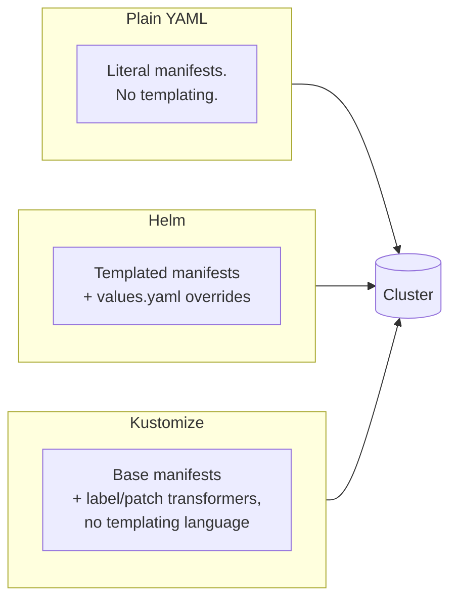

# Module 4: Deployment Sources — Helm & Kustomize

**Duration:** 1 hr
**Environment:** `kind` (local)
**Prerequisites:** Module 3 complete — Finovra deployed and `Synced`/`Healthy` via plain YAML

---

## Learning Objectives

By the end of this module, you should be able to:
- Explain the three ways ArgoCD can source manifests: plain YAML, Helm, and Kustomize
- Deploy Finovra via its Helm chart, and override values through the `Application` spec — both a values file and an ad-hoc parameter
- Deploy Finovra via a Kustomize overlay that patches one field on one resource, and explain why that avoids duplicating manifests across environments
- Make an informed call on which source type fits a given team or project

*(Jsonnet/Ksonnet exists as a fourth option but sees very little real-world adoption today — we're skipping it entirely, per this course's real-world-first philosophy.)*

---

## 1. Three Ways to Describe "What Should Be Running"

Every Application you've built so far points at a folder of pre-rendered, plain Kubernetes YAML. That's the simplest possible source type, but it's also the least flexible — no templating, no per-environment overrides, nothing except literal YAML. Helm and Kustomize both solve that, in different philosophies:



All three describe the *exact same* five Deployments and five Services you already have running. Nothing about the app changes this module — only how its manifests are packaged.

---

## 2. Helm: Templates + Values

Finovra's Helm chart lives in the `gitops` repo at `helm-chart/`:

```
helm-chart/
├── Chart.yaml
├── values.yaml          # defaults — every service at replicas: 1, image tag "1.0.0"
├── values-dev.yaml       # example override file — bumps dashboard to 2 replicas
└── templates/
    ├── dashboard.yaml
    ├── accounts-service.yaml
    ├── insurance-service.yaml
    ├── investments-service.yaml
    └── loans-service.yaml
```

Each template is templated from the same plain YAML you already know — for example, `accounts-service`'s image line went from this (Module 3):

```yaml
image: arsr319/finovra-accounts-service:1.0.0
```

to this (the chart):

```yaml
image: "{{ .Values.image.repository }}/finovra-accounts-service:{{ (index .Values "accounts-service").image.tag | default .Values.image.tag }}"
```

That `| default .Values.image.tag` pattern is deliberate: every service falls back to one global `image.tag` in `values.yaml`, but any service can be overridden **individually** — which matters a lot for Finovra specifically, since only the `dashboard` actually moves version-to-version. You'll never need to bump all five services just to ship a dashboard change.

> **This is one chart-organization pattern, not "the" pattern.** Finovra uses one umbrella chart with all five services templated inside it, sharing a single `values.yaml` — that fits because one team owns the whole app and every service deploys together. Once services have **independent teams and independent release cadences**, most real orgs split instead: either a separate chart per service (each with its own per-environment values files, e.g. `dev/dashboard-values.yaml`, `dev/payment-values.yaml`), or a parent chart with each service as a **subchart** (`charts/dashboard/`, `charts/accounts-service/`, each with its own `values.yaml`, overridable from the parent). Neither is more "correct" — it's a team-topology decision, not a Helm best practice you're missing. The per-service-chart pattern is also exactly what Module 8 (ApplicationSets) generates automatically, one Application per service, once that independence is real.

### Values files vs. ad-hoc parameters

Two different ways to override the defaults, both useful in different situations:

**A values file** — layer a whole file of overrides on top of `values.yaml`:
```bash
helm template finovra helm-chart -f helm-chart/values-dev.yaml
```
Good for a standing set of overrides you'd reuse — e.g. "how dev always differs from the chart's defaults."

**An ad-hoc parameter** — override one value inline, no file needed:
```bash
helm template finovra helm-chart --set dashboard.image.tag=1.0.1
```
Good for a one-off — e.g. previewing what a specific release would render before committing to it. (`1.0.1` here is the practice-broken dashboard build from Module 5/6 — this is a dry render only, nothing gets applied to your cluster.)

In an ArgoCD `Application`, both map directly onto `source.helm`:

```yaml
spec:
  source:
    repoURL: https://github.com/<your-username>/gitops.git
    targetRevision: main
    path: helm-chart
    helm:
      valueFiles:
        - values-dev.yaml
      parameters:
        - name: dashboard.image.tag
          value: "1.0.1"
```

---

## 3. Kustomize: Base + Overlays, No Templating Language

Finovra's Kustomize setup has two layers — a **base** (the shared manifests) and an **overlay** (environment-specific tweaks layered on top), which is the actual reason teams reach for Kustomize in the first place.

`kustomize/base/` is a self-contained copy of the same manifests plus one `kustomization.yaml`:

```yaml
apiVersion: kustomize.config.k8s.io/v1beta1
kind: Kustomization

resources:
  - dashboard-deployment.yaml
  - dashboard-service.yaml
  - accounts-service-deployment.yaml
  # ... one entry per file

labels:
  - pairs:
      managed-by: kustomize
    includeSelectors: false
```

On its own, that's not very interesting — it's the same manifests plus one label. The actual value shows up once you **overlay** something on top of it. `kustomize/overlays/dev/` does exactly that: it takes the base as-is and patches one field on one resource, without touching the base at all:

```yaml
# kustomize/overlays/dev/kustomization.yaml
apiVersion: kustomize.config.k8s.io/v1beta1
kind: Kustomization

resources:
  - ../../base

patches:
  - path: dashboard-replicas-patch.yaml
    target:
      kind: Deployment
      name: dashboard
```

```yaml
# kustomize/overlays/dev/dashboard-replicas-patch.yaml
apiVersion: apps/v1
kind: Deployment
metadata:
  name: dashboard
spec:
  replicas: 2
```

**This is when Kustomize actually earns its keep:** imagine `staging` needs `dashboard` at 2 replicas but every backend stays at 1, while `prod` needs different resource limits across the board. With plain YAML you'd maintain three full copies of every manifest. With Kustomize, you maintain **one base** and a handful of small overlay folders, each containing only the fields that differ for that environment — everything else is inherited untouched. That's the whole pitch: no duplication, no templating language, just "here's the base, here's what's different here."

> **Why a self-contained base, not a pointer back at `k8s/plain-manifests/`?** Kustomize refuses by default to read files outside the directory it's building from — a deliberate security boundary. A base is meant to stand alone; overlays are what reference *it*, not the other way around.

No `{{ }}` syntax anywhere — Kustomize never templates a file, it only **transforms** the plain YAML through a fixed set of operations (`labels`, `patches`, `images`, `namePrefix`, and a few others). Render it and diff against the plain manifests to see exactly what changed:

```bash
kubectl kustomize kustomize/base
```

Every resource comes out identical to the plain YAML, plus one thing: `labels.kustomize.config.k8s.io: managed-by: kustomize` stamped onto every object. That's the entire value proposition in miniature — compose changes onto existing YAML without editing (or duplicating logic into) the YAML itself.

---

## 4. Choosing Between Them

| | Plain YAML | Helm | Kustomize |
|---|---|---|---|
| Templating | None | Full templating language (`{{ }}`) | None — patches/transformers only |
| Best for | Small apps, few environments | Packaging for reuse across teams/orgs, complex parameterization | Layering environment-specific tweaks onto a shared base |
| Learning curve | Lowest | Steepest — Go template syntax | Low — just YAML |
| Real-world share | Common for small internal apps | Dominant for anything published/shared (most public Helm charts) | Very common for internal environment overlays (dev/staging/prod) |

There's no universally "correct" choice — plenty of real teams run all three for different apps in the same cluster. A rule of thumb: if you're **publishing** a chart for others to consume with varying needs, reach for Helm. If you're **layering your own environment differences** on top of one shared base, Kustomize tends to stay simpler longer. Module 7's promotion lab uses Kustomize overlays for exactly that reason.

---

## Lab: Convert Finovra to a Helm-Based Application

### Step 1 — Sanity-check the chart locally

In your fork of `gitops`:

```bash
helm lint helm-chart
helm template finovra helm-chart
```

Confirm it renders 5 Deployments + 5 Services with no errors, and every image tag reads `1.0.0`.

### Step 2 — Point your Application at the chart

Edit your `finovra.yaml` (the same file from Module 3) to match this exactly — `source.path` changes from `k8s/plain-manifests` to `helm-chart`, and the `directory.recurse` block is gone entirely (Helm doesn't use it, and leaving it in is a common copy-paste mistake here):

```yaml
apiVersion: argoproj.io/v1alpha1
kind: Application
metadata:
  name: finovra
  namespace: argocd
spec:
  project: default
  source:
    repoURL: https://github.com/<your-username>/gitops.git
    targetRevision: main
    path: helm-chart
  destination:
    server: https://kubernetes.default.svc
    namespace: finovra
  syncPolicy:
    automated:
      prune: true
      selfHeal: true
    syncOptions:
      - CreateNamespace=true
```

Apply it:

```bash
kubectl apply -f finovra.yaml
```

### Step 3 — Confirm nothing actually changes

```bash
argocd app get finovra
kubectl get pods -n finovra
```

`Sync Status: Synced`, `Health Status: Healthy`, same 5 Pods, same images. That's the point — the chart renders byte-identical manifests to what you had before. You've changed *how* the desired state is described, not *what* it is.

### Step 4 — Demo a values-file override

Add a `helm.valueFiles` block under `source` — everything else in the file stays exactly as it was in Step 2:

```yaml
apiVersion: argoproj.io/v1alpha1
kind: Application
metadata:
  name: finovra
  namespace: argocd
spec:
  project: default
  source:
    repoURL: https://github.com/<your-username>/gitops.git
    targetRevision: main
    path: helm-chart
    helm:
      valueFiles:
        - values-dev.yaml
  destination:
    server: https://kubernetes.default.svc
    namespace: finovra
  syncPolicy:
    automated:
      prune: true
      selfHeal: true
    syncOptions:
      - CreateNamespace=true
```

```bash
kubectl apply -f finovra.yaml
kubectl get deployment dashboard -n finovra -w
```

Watch `dashboard` scale from `1/1` to `2/2` — `values-dev.yaml` only touches `dashboard.replicas`, so it's the only Deployment that changes. Press `Ctrl+C` once it settles.

**Revert before continuing:** delete the `helm:` block (both lines) from `finovra.yaml`, reapply, and confirm `dashboard` scales back down to 1.

### Step 5 — Demo an ad-hoc parameter override

Same pattern — `finovra.yaml` unchanged except swapping last step's `helm:` block for this one:

```yaml
apiVersion: argoproj.io/v1alpha1
kind: Application
metadata:
  name: finovra
  namespace: argocd
spec:
  project: default
  source:
    repoURL: https://github.com/<your-username>/gitops.git
    targetRevision: main
    path: helm-chart
    helm:
      parameters:
        - name: dashboard.image.tag
          value: "1.0.1"
  destination:
    server: https://kubernetes.default.svc
    namespace: finovra
  syncPolicy:
    automated:
      prune: true
      selfHeal: true
    syncOptions:
      - CreateNamespace=true
```

```bash
kubectl apply -f finovra.yaml
kubectl get deployment dashboard -n finovra -o jsonpath='{.spec.template.spec.containers[0].image}'
```

You should see `arsr319/finovra-dashboard:1.0.1` — the practice-broken build from Module 5/6, deployed here just to prove the override mechanism works. Don't bother opening the browser; you already know what this one does.

**Revert:** delete the `helm:` block from `finovra.yaml`, reapply. Confirm you're back to `1.0.0` and `Health Status: Healthy`.

### Step 6 — Deploy the Kustomize overlay

First render it locally to see exactly what you're about to apply:

```bash
kubectl kustomize kustomize/overlays/dev
```

Confirm `dashboard` shows `replicas: 2` while the other four Deployments stay at `1`, and every resource carries the `managed-by: kustomize` label — the overlay inherited that from the base without redeclaring it.

Now point your Application at it — `source.path` changes to `kustomize/overlays/dev`, same as switching to `helm-chart` did in Step 2, and there's no `helm:` block this time:

```yaml
apiVersion: argoproj.io/v1alpha1
kind: Application
metadata:
  name: finovra
  namespace: argocd
spec:
  project: default
  source:
    repoURL: https://github.com/<your-username>/gitops.git
    targetRevision: main
    path: kustomize/overlays/dev
  destination:
    server: https://kubernetes.default.svc
    namespace: finovra
  syncPolicy:
    automated:
      prune: true
      selfHeal: true
    syncOptions:
      - CreateNamespace=true
```

```bash
kubectl apply -f finovra.yaml
kubectl get deployment dashboard -n finovra -w
```

Watch `dashboard` scale to `2/2` — deployed for real this time, through ArgoCD, from an overlay that never touched the base manifests. `kubectl get deployment dashboard -n finovra -o jsonpath='{.metadata.labels}'` should also show `managed-by: kustomize`.

**Revert before continuing:** set `source.path` back to `k8s/plain-manifests` and re-add `directory: recurse: true` under it, reapply, and confirm `dashboard` settles back to `1/1` with no `managed-by` label.

**Checkpoint:** you converted the same live Application through all three source types this module — plain YAML → Helm → Kustomize overlay — with the app staying `Synced`/`Healthy` throughout, and you've now seen Kustomize patch one field on one resource without duplicating or templating anything.

---

## Key Terms Glossary

| Term | Meaning |
|---|---|
| **Chart** | A Helm package — templates + a default `values.yaml` |
| **`values.yaml`** | A chart's default configuration; anything not overridden falls back to this |
| **`source.helm.valueFiles`** | Application-level list of additional values files layered on top of the chart's defaults |
| **`source.helm.parameters`** | Application-level list of single ad-hoc value overrides, equivalent to `helm --set` |
| **Kustomize base** | A self-contained, plain-YAML directory that overlays are built on top of |
| **Kustomize overlay** | A directory that references a base and layers environment-specific patches/labels on top, without editing the base |
| **Kustomize patch** | A targeted change to one field on one resource — Finovra's `dev` overlay patches only `dashboard`'s `replicas` |
| **Kustomize transformer** | An operation (labels, patches, images, etc.) Kustomize applies to a base or overlay — never templating, always structural |

---

## Recap Questions

1. Why does the Helm chart's image-tag logic fall back to a global `.Values.image.tag` instead of requiring every service to set its own tag explicitly?
2. What's the practical difference between `source.helm.valueFiles` and `source.helm.parameters` — when would you reach for each?
3. Why does Kustomize's base at `kustomize/base/` contain its own copies of the manifests instead of referencing `k8s/plain-manifests/` directly?
4. The `dev` overlay's patch only mentions `dashboard` and only sets `replicas: 2`. Why did the other four Deployments still come out with the `managed-by: kustomize` label?
5. If `staging` and `prod` both needed their own replica counts, what would you add to `kustomize/overlays/` — and what would you *not* need to touch?
6. In one sentence each: when would a team reach for Helm over Kustomize, and vice versa?

---

## What's Next

In **Module 5**, we deploy a deliberately broken dashboard release and recover from it three different ways: native ArgoCD rollback, `git revert`, and pausing reconciliation during an incident. (Building your own images with CI is covered later, in the Capstone project.)
