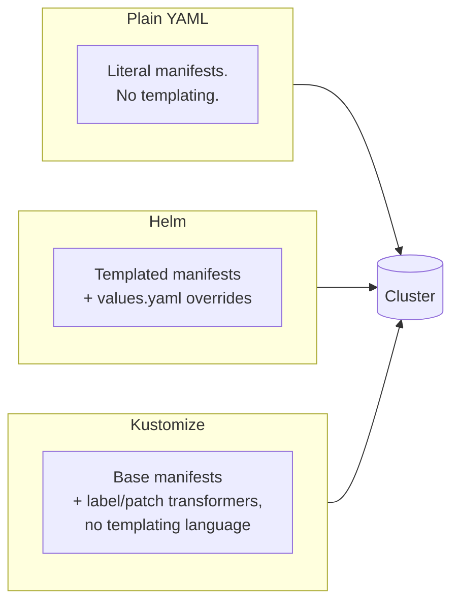

# Module 4: Deployment Sources — Helm & Kustomize

**Duration:** 45 min
**Environment:** `kind` (local)
**Prerequisites:** Module 3 complete — Finovra deployed and `Synced`/`Healthy` via plain YAML

---

## Learning Objectives

By the end of this module, you should be able to:
- Explain the three ways ArgoCD can source manifests: plain YAML, Helm, and Kustomize
- Deploy Finovra via its Helm chart, and override values through the `Application` spec — both a values file and an ad-hoc parameter
- Render Finovra via a Kustomize base and explain what it changes without touching the original YAML
- Make an informed call on which source type fits a given team or project

*(Jsonnet/Ksonnet exists as a fourth option but sees very little real-world adoption today — we're skipping it entirely, per this course's real-world-first philosophy.)*

---

## 1. Three Ways to Describe "What Should Be Running"

Every Application you've built so far points at a folder of pre-rendered, plain Kubernetes YAML. That's the simplest possible source type, but it's also the least flexible — no templating, no per-environment overrides, nothing except literal YAML. Helm and Kustomize both solve that, in different philosophies:



All three describe the *exact same* five Deployments and five Services you already have running. Nothing about the app changes this module — only how its manifests are packaged.

---

## 2. Helm: Templates + Values

Finovra's Helm chart lives in the `gitops` repo at `helm-chart/`:

```
helm-chart/
├── Chart.yaml
├── values.yaml          # defaults — every service at replicas: 1, image tag "1.0.0"
├── values-dev.yaml       # example override file — bumps dashboard to 2 replicas
└── templates/
    ├── dashboard.yaml
    ├── accounts-service.yaml
    ├── insurance-service.yaml
    ├── investments-service.yaml
    └── loans-service.yaml
```

Each template is templated from the same plain YAML you already know — for example, `accounts-service`'s image line went from this (Module 3):

```yaml
image: arsr319/finovra-accounts-service:1.0.0
```

to this (the chart):

```yaml
image: "{{ .Values.image.repository }}/finovra-accounts-service:{{ (index .Values "accounts-service").image.tag | default .Values.image.tag }}"
```

That `| default .Values.image.tag` pattern is deliberate: every service falls back to one global `image.tag` in `values.yaml`, but any service can be overridden **individually** — which matters a lot for Finovra specifically, since only the `dashboard` actually moves version-to-version. You'll never need to bump all five services just to ship a dashboard change.

### Values files vs. ad-hoc parameters

Two different ways to override the defaults, both useful in different situations:

**A values file** — layer a whole file of overrides on top of `values.yaml`:
```bash
helm template finovra helm-chart -f helm-chart/values-dev.yaml
```
Good for a standing set of overrides you'd reuse — e.g. "how dev always differs from the chart's defaults."

**An ad-hoc parameter** — override one value inline, no file needed:
```bash
helm template finovra helm-chart --set dashboard.image.tag=1.0.1
```
Good for a one-off — e.g. previewing what a specific release would render before committing to it. (`1.0.1` here is the practice-broken dashboard build from Module 6/7 — this is a dry render only, nothing gets applied to your cluster.)

In an ArgoCD `Application`, both map directly onto `source.helm`:

```yaml
spec:
  source:
    repoURL: https://github.com/<your-username>/gitops.git
    targetRevision: main
    path: helm-chart
    helm:
      valueFiles:
        - values-dev.yaml
      parameters:
        - name: dashboard.image.tag
          value: "1.0.1"
```

---

## 3. Kustomize: Base + Transformers, No Templating Language

Finovra's Kustomize base lives at `kustomize/base/` — a self-contained copy of the same manifests plus one `kustomization.yaml`:

```yaml
apiVersion: kustomize.config.k8s.io/v1beta1
kind: Kustomization

resources:
  - dashboard-deployment.yaml
  - dashboard-service.yaml
  - accounts-service-deployment.yaml
  # ... one entry per file

labels:
  - pairs:
      managed-by: kustomize
    includeSelectors: false
```

> **Why a self-contained base, not a pointer back at `k8s/plain-manifests/`?** Kustomize refuses by default to read files outside the directory it's building from — a deliberate security boundary. A base is meant to stand alone; overlays are what reference *it*, not the other way around.

No `{{ }}` syntax anywhere — Kustomize never templates a file, it only **transforms** the plain YAML through a fixed set of operations (`labels`, `patches`, `images`, `namePrefix`, and a few others). Render it and diff against the plain manifests to see exactly what changed:

```bash
kubectl kustomize kustomize/base
```

Every resource comes out identical to the plain YAML, plus one thing: `labels.kustomize.config.k8s.io: managed-by: kustomize` stamped onto every object. That's the entire value proposition in miniature — compose changes onto existing YAML without editing (or duplicating logic into) the YAML itself.

---

## 4. Choosing Between Them

| | Plain YAML | Helm | Kustomize |
|---|---|---|---|
| Templating | None | Full templating language (`{{ }}`) | None — patches/transformers only |
| Best for | Small apps, few environments | Packaging for reuse across teams/orgs, complex parameterization | Layering environment-specific tweaks onto a shared base |
| Learning curve | Lowest | Steepest — Go template syntax | Low — just YAML |
| Real-world share | Common for small internal apps | Dominant for anything published/shared (most public Helm charts) | Very common for internal environment overlays (dev/staging/prod) |

There's no universally "correct" choice — plenty of real teams run all three for different apps in the same cluster. A rule of thumb: if you're **publishing** a chart for others to consume with varying needs, reach for Helm. If you're **layering your own environment differences** on top of one shared base, Kustomize tends to stay simpler longer. Module 9's promotion lab uses Kustomize overlays for exactly that reason.

---

## Lab: Convert Finovra to a Helm-Based Application

### Step 1 — Sanity-check the chart locally

In your fork of `gitops`:

```bash
helm lint helm-chart
helm template finovra helm-chart
```

Confirm it renders 5 Deployments + 5 Services with no errors, and every image tag reads `1.0.0`.

### Step 2 — Point your Application at the chart

Edit your `finovra-app.yaml` (the same file from Module 3) — change `source.path` from `k8s/plain-manifests` to `helm-chart`, and drop `directory.recurse` (Helm doesn't use it):

```yaml
spec:
  source:
    repoURL: https://github.com/<your-username>/gitops.git
    targetRevision: main
    path: helm-chart
```

Apply it:

```bash
kubectl apply -f finovra-app.yaml
```

### Step 3 — Confirm nothing actually changes

```bash
argocd app get finovra
kubectl get pods -n finovra
```

`Sync Status: Synced`, `Health Status: Healthy`, same 5 Pods, same images. That's the point — the chart renders byte-identical manifests to what you had before. You've changed *how* the desired state is described, not *what* it is.

### Step 4 — Demo a values-file override

Add `valueFiles` to your Application:

```yaml
spec:
  source:
    repoURL: https://github.com/<your-username>/gitops.git
    targetRevision: main
    path: helm-chart
    helm:
      valueFiles:
        - values-dev.yaml
```

```bash
kubectl apply -f finovra-app.yaml
kubectl get deployment dashboard -n finovra -w
```

Watch `dashboard` scale from `1/1` to `2/2` — `values-dev.yaml` only touches `dashboard.replicas`, so it's the only Deployment that changes. Press `Ctrl+C` once it settles.

**Revert before continuing:** remove the `helm.valueFiles` block and reapply, so `dashboard` scales back to 1.

### Step 5 — Demo an ad-hoc parameter override

```yaml
spec:
  source:
    repoURL: https://github.com/<your-username>/gitops.git
    targetRevision: main
    path: helm-chart
    helm:
      parameters:
        - name: dashboard.image.tag
          value: "1.0.1"
```

```bash
kubectl apply -f finovra-app.yaml
kubectl get deployment dashboard -n finovra -o jsonpath='{.spec.template.spec.containers[0].image}'
```

You should see `arsr319/finovra-dashboard:1.0.1` — the practice-broken build from Module 6/7, deployed here just to prove the override mechanism works. Don't bother opening the browser; you already know what this one does.

**Revert:** remove the `helm.parameters` block and reapply. Confirm you're back to `1.0.0` and `Health Status: Healthy`.

### Step 6 — Render the Kustomize base (no redeploy needed)

```bash
kubectl kustomize kustomize/base | grep -A2 "labels:"
```

Confirm `managed-by: kustomize` is stamped onto every resource, and that everything else matches the plain YAML. This module's graded lab is the Helm conversion above — Kustomize overlays get their hands-on moment in Module 9 (Promotion), once there's an actual dev/staging split to justify one.

**Checkpoint:** you converted a live Application from plain YAML to Helm with zero change in what's running, demonstrated both override mechanisms and reverted each cleanly, and confirmed the Kustomize base renders an equivalent (plus one label) without ever writing `{{ }}` anywhere.

---

## Key Terms Glossary

| Term | Meaning |
|---|---|
| **Chart** | A Helm package — templates + a default `values.yaml` |
| **`values.yaml`** | A chart's default configuration; anything not overridden falls back to this |
| **`source.helm.valueFiles`** | Application-level list of additional values files layered on top of the chart's defaults |
| **`source.helm.parameters`** | Application-level list of single ad-hoc value overrides, equivalent to `helm --set` |
| **Kustomize base** | A self-contained, plain-YAML directory that overlays are built on top of |
| **Kustomize transformer** | An operation (labels, patches, images, etc.) Kustomize applies to a base — never templating, always structural |

---

## Recap Questions

1. Why does the Helm chart's image-tag logic fall back to a global `.Values.image.tag` instead of requiring every service to set its own tag explicitly?
2. What's the practical difference between `source.helm.valueFiles` and `source.helm.parameters` — when would you reach for each?
3. Why does Kustomize's base at `kustomize/base/` contain its own copies of the manifests instead of referencing `k8s/plain-manifests/` directly?
4. In one sentence each: when would a team reach for Helm over Kustomize, and vice versa?

---

## What's Next

In **Module 5**, we finally look under the hood at how Finovra's images actually get built: a GitHub Actions workflow that builds a new `dashboard` image, pushes it to Docker Hub, and bumps the tag in `gitops` automatically — closing the loop between CI and the GitOps deployment you've been practicing since Module 3.
