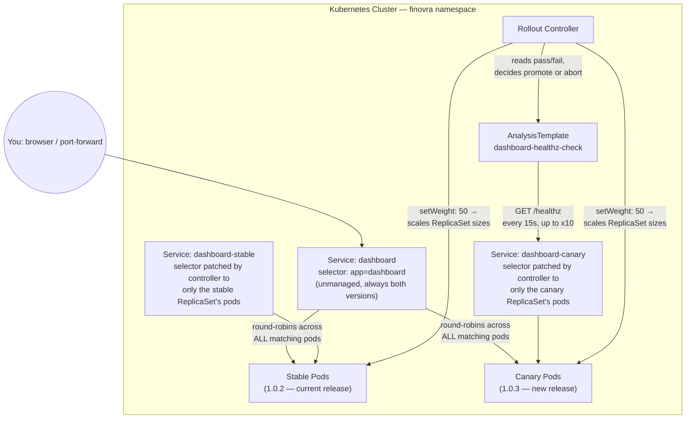

# Module 6: Progressive Delivery with Argo Rollouts

**Environment:** `kind` (local)
**Prerequisites:** Module 5 complete — you've recovered from a bad dashboard release three different ways

---

## Learning Objectives

By the end of this module, you should be able to:
- Explain why plain ArgoCD sync isn't enough for a release you're not fully confident in
- Explain the difference between canary and blue-green strategies, and when a team would reach for each
- Convert a Helm-templated Deployment into an Argo Rollouts canary, with a dedicated canary Service for targeted checks
- Write an `AnalysisTemplate` that checks something plain health probes can't
- Watch a bad release get caught and automatically aborted — before it ever reaches full rollout, with zero manual rollback command

---

## 1. Why Plain Sync Isn't Enough

Every deploy so far has worked the same way: push a change, ArgoCD applies it to every Pod, and you find out afterward whether it was a good idea. We've already seen how bad "afterward" can be. A broken release can look completely `Healthy` to ArgoCD while it's actually broken for real users.

**Argo Rollouts** fixes this by changing the shape of a deploy:
- A new release first ships to a small subset of Pods — the **canary**
- The canary gets checked automatically
- Only if the check passes does the release continue toward 100%
- If the check fails, Argo Rollouts aborts on its own — most traffic never touches the bad release

This module's practice material is a new, broken build: `arsr319/finovra-dashboard:1.0.3`. It's a genuinely different image, not the same build with a setting flipped — the bug is baked in at build time (see the appendix at the end of this module for exactly how). The bug lives in a dedicated `/healthz` endpoint, which is what the canary analysis checks — and, so you can *see* the bad release with your own eyes and not just take the analysis's word for it, two of the dashboard's four tiles (`insurance`, `loans`) render visibly broken (red, "Failed to load") whenever a request happens to land on a `1.0.3` Pod. The plain `/` endpoint, which ordinary Pod probes check, stays up and returns `200` the whole time — a plain `Deployment`'s liveness/readiness probes would never have caught this.

---

## 2. Canary vs. Blue-Green

Argo Rollouts supports two progressive delivery strategies. This module labs **canary** — it's the one you'll reach for most often. It's still worth knowing what **blue-green** does differently, since you'll see it in other teams' `Rollout` specs.

**Canary:**
- A new release gets a *partial* slice of traffic (in this module, `setWeight: 50`)
- It runs alongside the old version and gets checked
- If the check passes, traffic ramps toward 100%
- If it fails, the rollout aborts
- Two versions deliberately serve real traffic side-by-side, briefly

**Blue-green:**
- Two full, independent environments: "blue" (currently active) and "green" (the new release)
- Green deploys completely and gets verified separately — often through a `previewService` that never receives real user traffic
- Traffic then cuts over **all at once** — one moment everyone hits blue, the next everyone hits green
- Blue keeps running afterward, so rollback just means flipping traffic back, not a redeploy

| | Canary | Blue-Green |
|---|---|---|
| Traffic shift | Gradual (a %, ramping toward 100) | Instant, all-or-nothing |
| Versions serving real users at once | Both, briefly, by design | Only one, ever |
| Rollback | Abort the ramp — traffic was never fully shifted | Flip back to the still-running old environment |
| Best fit | Most stateless services — gradual exposure limits blast radius | Cases where mixed-version traffic is itself the danger (e.g. schema-sensitive clients) |

In an Argo Rollouts spec, blue-green uses `strategy.blueGreen` instead of `strategy.canary`, and `activeService`/`previewService` instead of `canaryService`/`stableService`. We're not building this today — canary demonstrates the core idea (automated analysis gates a release) with less setup, and it's the strategy you'll use most often in practice. Recognizing `strategy.blueGreen` when you see it, and knowing it means "verify fully, then cut over all at once," is enough for now.

---

## 3. Installing Argo Rollouts

Argo Rollouts is a separate controller with its own CRDs. Install both the controller and the `kubectl` plugin used to inspect rollouts.

```bash
kubectl create namespace argo-rollouts
kubectl apply -n argo-rollouts -f https://github.com/argoproj/argo-rollouts/releases/latest/download/install.yaml

# macOS
brew install argoproj/tap/kubectl-argo-rollouts

# Linux
curl -LO https://github.com/argoproj/argo-rollouts/releases/latest/download/kubectl-argo-rollouts-linux-amd64
chmod +x kubectl-argo-rollouts-linux-amd64
sudo mv kubectl-argo-rollouts-linux-amd64 /usr/local/bin/kubectl-argo-rollouts
```

Verify:

```bash
kubectl argo rollouts version
kubectl get pods -n argo-rollouts
```

ArgoCD itself needs no changes — it already understands the `Rollout` resource's health, the same way it understands a plain `Deployment`.

---

## 4. Canary Strategy, In the Chart

`dashboard`'s Helm template, at `helm-chart/templates/dashboard.yaml`, is currently a plain `Deployment`. Converting it to a `Rollout` means two changes:
- Swap `apiVersion` and `kind`
- Add a `strategy` block

The parts that are already templated — image tag, resources — stay exactly the same:

```yaml
apiVersion: argoproj.io/v1alpha1
kind: Rollout
metadata:
  name: dashboard
spec:
  replicas: {{ .Values.dashboard.replicas }}
  # ...same selector/template as before, including the same
  # image-tag fallback pattern used elsewhere in the chart...
  strategy:
    canary:
      canaryService: dashboard-canary
      stableService: dashboard-stable
      steps:
        - setWeight: 50
        - analysis:
            templates:
              - templateName: dashboard-healthz-check
```

- **`canaryService` / `stableService`** — two Services the Rollout controller manages for you, each pointed at just the canary Pods or just the stable Pods. You pre-create them as empty shells; the controller fills in the right selector.
- **`steps`** — `setWeight: 50` splits replicas roughly 50/50 between canary and stable. `analysis` then runs a check against the canary before going any further.
- **What stays unchanged:** the existing `dashboard` Service (what you `port-forward` to view the app) still selects on plain `app: dashboard`, so it keeps working exactly as before. `canaryService`/`stableService` exist purely so the analysis step has something precise to check.
- **What's not here:** no `FAIL_MODE`/`FAIL_TILES` field in `values.yaml`, no chart change of any kind to make `1.0.3` fail. Those two env vars exist in `dashboard`'s code, but for `1.0.3` they're baked in as image-level defaults at `docker build` time (see the appendix), not passed in by the chart. From the chart's point of view, `1.0.3` is just another tag — a canary of a bad release is just a canary of a bad image tag, the same "bump a value" motion you already know.

The canary/stable Services and the `AnalysisTemplate` don't need any templating — they're static, so they live in one new chart file, `dashboard-canary.yaml`:

```yaml
apiVersion: v1
kind: Service
metadata:
  name: dashboard-canary
spec:
  selector:
    app: dashboard
  ports:
    - port: 3000
      targetPort: 3000
---
apiVersion: v1
kind: Service
metadata:
  name: dashboard-stable
spec:
  selector:
    app: dashboard
  ports:
    - port: 3000
      targetPort: 3000
---
apiVersion: argoproj.io/v1alpha1
kind: AnalysisTemplate
metadata:
  name: dashboard-healthz-check
spec:
  metrics:
    - name: healthz-ok
      interval: 15s
      count: 10
      consecutiveErrorLimit: 8
      successCondition: result == "ok"
      provider:
        web:
          url: "http://dashboard-canary.finovra.svc.cluster.local:3000/healthz"
          jsonPath: "{$.status}"
```

How this `AnalysisTemplate` works:
- The `web` provider does an HTTP GET against the canary-specific service
- It pulls `status` out of the JSON response using `jsonPath`
- It compares that value against `successCondition`
- `interval`/`count` mean "check up to 10 times, 15 seconds apart" — a spread-out sample, not one roll of the dice

If the HTTP call itself fails — like our `/healthz` returning a `500` — the metric never even gets to evaluate `successCondition`. A non-2xx response counts as a measurement error on its own. Enough consecutive errors (`consecutiveErrorLimit`) aborts the rollout, the same as failing the condition outright. The default `consecutiveErrorLimit` is `4`, which (at the default `interval: 10s`) aborts in well under a minute — barely enough time to alt-tab to a browser. This module sets it to `8` at `interval: 15s` instead, so a failing canary stays up for roughly two minutes (`8 × 15s`) before the controller scales it down — long enough to keep refreshing the dashboard in a browser tab and actually land on a broken canary Pod a few times, not just take the analysis's word for it.

### Why Three Services, and How Traffic Actually Reaches Each One



| Service | Who talks to it | What it actually routes to |
|---|---|---|
| **`dashboard`** | You (via `port-forward`), or whatever sits in front of the app in a real deployment | Every Pod labeled `app: dashboard` — stable *and* canary, indiscriminately. It's a plain, unmanaged Service; it doesn't know or care which ReplicaSet a Pod belongs to. |
| **`dashboard-canary`** | Only the `AnalysisTemplate` | Just the canary ReplicaSet's Pods (the new, unverified version). The Rollout controller patches this Service's selector at runtime to scope it precisely — that's the "empty shell" you pre-create getting filled in. |
| **`dashboard-stable`** | Nothing in this lab calls it directly, but it exists for the same reason `dashboard-canary` does | Just the stable ReplicaSet's Pods (the last known-good version). Useful if you later add a check or an ingress rule that needs to hit *only* the proven version. |

**How the traffic split actually happens — the part that trips people up:** there's no service mesh or weighted-routing ingress in this setup (no Istio, no NGINX canary annotations, no `trafficRouting` block in the `Rollout` spec). So `setWeight: 50` doesn't create a literal "50% of requests" rule anywhere. What it actually does is tell the controller to scale the ReplicaSets so roughly half the `app: dashboard` Pods are canary and half are stable. The plain `dashboard` Service then does ordinary Kubernetes round-robin load balancing across *all* of those Pods — so the ~50/50 traffic split you get is a side effect of the ~50/50 Pod count, not a rule enforced at the Service or network layer. `dashboard-canary` and `dashboard-stable` exist purely so the `AnalysisTemplate` can aim a probe at *only* the new version — something the plain `dashboard` Service can't do, since it can't distinguish the two ReplicaSets.

---

## Lab: Ship a Canary, Then Break One

All of this happens in your fork of `gitops`.

### Step 1 — Convert the dashboard's Helm template to a Rollout

Replace `helm-chart/templates/dashboard.yaml`'s content with this in full. Note that **both** `apiVersion` and `kind` change at the top, not just `kind`: `Rollout` is a different CRD entirely, not a renamed `Deployment`. Leaving `apiVersion: apps/v1` in place will make the apply fail.

```yaml
apiVersion: argoproj.io/v1alpha1
kind: Rollout
metadata:
  name: dashboard
  labels:
    app: dashboard
spec:
  replicas: {{ .Values.dashboard.replicas }}
  selector:
    matchLabels:
      app: dashboard
  template:
    metadata:
      labels:
        app: dashboard
    spec:
      containers:
        - name: dashboard
          image: "{{ .Values.image.repository }}/finovra-dashboard:{{ .Values.dashboard.image.tag | default .Values.image.tag }}"
          ports:
            - containerPort: 3000
          env:
            - name: PORT
              value: "3000"
            - name: VERSION
              value: "{{ .Values.dashboard.image.tag | default .Values.image.tag }}"
            - name: SERVICES
              value: "accounts:http://accounts-service:8000,insurance:http://insurance-service:8000,investments:http://investments-service:8000,loans:http://loans-service:8000"
          livenessProbe:
            httpGet:
              path: /
              port: 3000
            initialDelaySeconds: 3
          readinessProbe:
            httpGet:
              path: /
              port: 3000
            initialDelaySeconds: 3
          resources:
            {{- toYaml .Values.dashboard.resources | nindent 12 }}
  strategy:
    canary:
      canaryService: dashboard-canary
      stableService: dashboard-stable
      steps:
        - setWeight: 50
        - analysis:
            templates:
              - templateName: dashboard-healthz-check
---
apiVersion: v1
kind: Service
metadata:
  name: dashboard
  labels:
    app: dashboard
spec:
  selector:
    app: dashboard
  ports:
    - port: 3000
      targetPort: 3000
```

Add `helm-chart/templates/dashboard-canary.yaml` — the two Services and the `AnalysisTemplate` shown above. Then update the `dashboard:` block in `helm-chart/values.yaml`:

```yaml
dashboard:
  replicas: 2
  image:
    tag: "1.0.2"
  resources:
    requests:
      cpu: 50m
      memory: 64Mi
    limits:
      cpu: 100m
      memory: 128Mi
```

Sanity-check it locally:

```bash
helm lint helm-chart
helm template finovra helm-chart | grep -A2 "kind: Rollout"
```

Confirm it renders one `Rollout` (not `Deployment`) for `dashboard`, with `image: "arsr319/finovra-dashboard:1.0.2"` and no `FAIL_MODE` env entry anywhere. Then ship it:

```bash
git add helm-chart/
git commit -m "Convert dashboard to an Argo Rollouts canary"
git push origin main
```

### Step 2 — Confirm the first rollout deploys cleanly

There's no prior release to canary against yet, so the very first rollout skips straight to fully deployed:

```bash
kubectl argo rollouts get rollout dashboard -n finovra
```

Wait for `Status: ✔ Healthy`, `Step: 2/2`, `SetWeight: 100`. Confirm `argocd app get finovra` also shows `Synced`/`Healthy` — ArgoCD is reading the Rollout's own status, not guessing.

### Step 3 — Ship a good change, watch the canary pass

Optional. If you'd rather see one full successful canary cycle before breaking anything, push any harmless change to `helm-chart/values.yaml` (leave `dashboard.image.tag: "1.0.2"` as-is) and watch it sail through `Step: 2/2` on its own. Otherwise, move straight to Step 4.

### Step 4 — Inject the failure

Bump `dashboard.image.tag` to `"1.0.3"` in `helm-chart/values.yaml`, commit, push:

```bash
git add helm-chart/values.yaml
git commit -m "Ship a bad dashboard release: bump image tag to 1.0.3"
git push origin main
```

Watch it happen. This takes about two minutes end to end, so don't be surprised if nothing looks different for the first 30-40 seconds:

```bash
kubectl argo rollouts get rollout dashboard -n finovra --watch
```

You'll see `SetWeight` jump to `50`, then the analysis step start running. **While that's in progress**, open the dashboard in your browser (or keep it open from an earlier module) and refresh it repeatedly every few seconds. Because `dashboard`'s Service round-robins across both the stable and canary Pods, roughly every other refresh should land on a `1.0.3` Pod — you'll see the `insurance` and `loans` tiles flip to red ("Failed to load") on those hits, and back to normal green on the ones that land on a stable `1.0.2` Pod. That's the same 50/50 split the analysis is independently checking, just made visible.

After enough failed checks (`8` in a row, at `15s` apart — about two minutes), the rollout status flips to `✖ Degraded` with a message like:

```
RolloutAborted: ... Metric "healthz-ok" assessed Error due to consecutiveErrors (9) > consecutiveErrorLimit (8): "Error Message: received non 2xx response code: 500"
```

Once that happens, the canary Pods get scaled down and every refresh goes back to all-green — so if you want another look at the red tiles, catch it before the `Degraded` status appears. Press `Ctrl+C`. Then confirm two things:

```bash
argocd app get finovra
kubectl get svc dashboard-stable -n finovra -o jsonpath='{.spec.selector}'
curl -s http://localhost:8082/api/tiles   # if you still have the port-forward from earlier modules running
```

Two things to notice:
- **`Sync Status` stays `Synced`.** Git and the live Rollout object agree — `1.0.3` really is the image that's declared and rendered. Only `Health Status` flags the problem, because the *analysis* failed, not because anything drifted from Git.
- **The stable Pods — still running `1.0.2` — never stopped serving traffic.**

### Step 5 — Fix it and confirm recovery

```bash
git revert HEAD
git push origin main
kubectl argo rollouts get rollout dashboard -n finovra --watch
```

A fresh commit is a fresh revision, so Argo Rollouts attempts the canary again from scratch — no special "retry" command needed. Watch it pass the analysis this time and promote to `Step: 2/2`, `SetWeight: 100`, `Healthy`.

**Checkpoint:** you've watched a canary release get caught and rolled back automatically. No `argocd app rollback`, no `git revert` *before* the fact — nothing manual in the moment it mattered. The only human action was deciding what change to push next.

---

## Key Terms Glossary

| Term | Meaning |
|---|---|
| **Canary** | A small subset of Pods running the new release, checked before the rest of the fleet is updated |
| **Blue-Green** | An alternative strategy: the new release deploys fully and gets verified separately, then traffic cuts over all at once — no gradual ramp, no mixed-version traffic |
| **`canaryService` / `stableService`** | Services the Rollout controller manages automatically, each scoped to just canary or just stable Pods |
| **`activeService` / `previewService`** | Blue-green's equivalent of `canaryService`/`stableService` — `previewService` is where you verify the new version before the cutover |
| **`AnalysisTemplate`** | A reusable definition of what to check and how often, referenced by name from a Rollout's steps |
| **`web` provider** | An `AnalysisTemplate` metric type that does an HTTP GET and evaluates the response |
| **`consecutiveErrorLimit`** | How many failed HTTP calls in a row before the analysis gives up and counts it as a failure — separate from `successCondition` failing |
| **RolloutAborted** | The terminal state when analysis fails during a canary step — the release stops advancing, stable Pods keep serving |

---

## Recap Questions

1. Why does the `dashboard` Service (used for viewing the app) keep working normally throughout this whole module, while `dashboard-canary` and `dashboard-stable` exist as separate Services?
2. In Step 4, why did `Sync Status` stay `Synced` even while the Rollout was actively failing?
3. Why couldn't a plain `Deployment`'s liveness/readiness probes have caught `1.0.3`'s bug the way the canary analysis did?
4. In Step 5, why didn't you need to run any special "retry" command to get the Rollout to attempt the canary again?
5. A schema-sensitive client can't tolerate two API versions being live at once, even briefly. Would you reach for canary or blue-green here — and what specifically about canary makes it the wrong fit?

---

## What's Next

In **Module 7**, we build a real dev → staging → prod promotion flow using Kustomize overlays and a PR-based workflow — plus a short add-on on Sync Waves and Lifecycle Hooks, using Finovra's own dashboard-depends-on-backends shape as the example.

---

## Appendix: How the `1.0.3` Image Was Built (Instructor Note)

This isn't part of the lab — it's here so `1.0.3` can be rebuilt or a future bad tag can be made the same way, without re-deriving the mechanism.

`dashboard`'s `server.js` supports two independent, env-driven failure toggles, both defaulting to off/empty so every normal build stays clean:
- `FAIL_MODE=true` — makes `/healthz` return `500` instead of `200`. This is what the `AnalysisTemplate` catches.
- `FAIL_TILES=insurance,loans` — makes `/api/tiles` report those specific services as failed (`status: "error"`, rendered as a red tile), regardless of whether the real backend is actually healthy. This is what makes the bad canary visible in the browser, independent of the automated check.

Neither is wired into `values.yaml` or the Helm chart — on purpose, so bumping the image tag stays the only thing the chart needs to know about. Instead, the `Dockerfile` exposes them as build args with safe defaults:

```dockerfile
ARG FAIL_MODE=false
ARG FAIL_TILES=""
ENV FAIL_MODE=${FAIL_MODE}
ENV FAIL_TILES=${FAIL_TILES}
```

The CI workflow (`dashboard-image.yml`) never passes these args, so every image it builds from a normal `VERSION` bump is clean. `1.0.3` was instead built and pushed by hand, once, with the bad defaults baked in at the image level:

```bash
cd services/dashboard
docker build \
  --build-arg FAIL_MODE=true \
  --build-arg FAIL_TILES=insurance,loans \
  -t arsr319/finovra-dashboard:1.0.3 .
docker push arsr319/finovra-dashboard:1.0.3
```

Because the bad behavior lives entirely in that one image's build args — not in source code checked into `main`, not in a chart value — `main` and the CI pipeline never need to know `1.0.3` is broken. Rebuilding it later, or minting a new bad tag (e.g. for a different module), is the same two-line `docker build`/`docker push` with a new `-t`.
