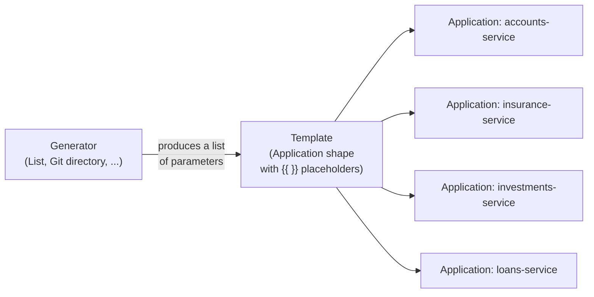

# Module 8: Scaling to Many Apps — ApplicationSets

**Environment:** `kind` (local)
**Prerequisites:** Module 7 complete — `finovra`/`finovra-staging`/`finovra-prod` all managed from one App-of-Apps root

---

## Learning Objectives

By the end of this module, you should be able to:
- Explain why hand-writing one `Application` YAML per service (or per environment) stops scaling, and what an `ApplicationSet` replaces that with
- Generate a fixed set of `Application`s from a static list using the **List generator**
- Generate one `Application` per matching Git directory using the **Git directory generator**, and explain what happens when a new directory shows up later
- Exclude a specific directory from a Git generator's matches
- Read an `ApplicationSet`'s `generators`/`template` split and explain what each half is responsible for

---

## 1. The Problem: One YAML Per App Stops Scaling

Count what Module 7 left you maintaining by hand: `apps/finovra.yaml`, `apps/finovra-staging.yaml`, `apps/finovra-prod.yaml`, plus `apps/root.yaml` to tie them together — four files, for **one app across three environments**. That was already a little repetitive; `finovra-staging.yaml` and `finovra-prod.yaml` differ from each other in exactly two fields (`path`, `destination.namespace`) and are otherwise identical copy-paste.

Now imagine Finovra had ten services instead of four backends and a dashboard, each with its own repo directory, each needing its own `Application` per environment. That's thirty near-identical YAML files, each one a chance to typo a namespace, forget `CreateNamespace=true`, or drift out of sync with the pattern everyone else is copying from.

**`ApplicationSet`** solves this by splitting the problem in two: a **generator** produces a list of "here's what varies" (a service name, a directory path, an environment), and a **template** describes "here's the `Application` shape, with placeholders for whatever the generator gives me." One `ApplicationSet` object, applied once, produces and keeps in sync as many `Application` objects as the generator finds.



Unlike Argo Rollouts back in Module 6, there's nothing separate to install here — the ApplicationSet controller ships bundled with ArgoCD's own Helm chart and has been running in your cluster since Module 2, whether you'd used it yet or not:

```bash
kubectl get pods -n argocd | grep applicationset
```

This course covers exactly two generators — the two real teams reach for day-to-day. (ApplicationSets support several more — Matrix, SCM Provider, Pull Request — mentioned in ArgoCD's own docs but genuinely niche; skipped here per this course's real-world-first approach.)

---

## 2. The List Generator

The simplest possible generator: a literal, static list of items, written directly in the `ApplicationSet` spec. Each item's fields become placeholders you can reference in `template`.

Here's what Module 7's entire `apps/` folder — `finovra.yaml`, `finovra-staging.yaml`, `finovra-prod.yaml` — looks like collapsed into one `ApplicationSet`:

```yaml
apiVersion: argoproj.io/v1alpha1
kind: ApplicationSet
metadata:
  name: finovra-environments
  namespace: argocd
spec:
  generators:
    - list:
        elements:
          - env: dev
            path: helm-chart
            namespace: finovra
          - env: staging
            path: kustomize/overlays/staging
            namespace: finovra-staging
          - env: prod
            path: kustomize/overlays/prod
            namespace: finovra-prod
  template:
    metadata:
      name: 'finovra-{{env}}'
    spec:
      project: default
      source:
        repoURL: https://github.com/<your-username>/gitops.git
        targetRevision: main
        path: '{{path}}'
      destination:
        server: https://kubernetes.default.svc
        namespace: '{{namespace}}'
      syncPolicy:
        automated:
          prune: true
          selfHeal: true
        syncOptions:
          - CreateNamespace=true
```

Three `elements`, one `template` — and the rendered result is byte-for-byte the same three `Application`s you hand-wrote in Module 7, just generated instead of copy-pasted. **This module doesn't apply this one for real** — your real `finovra`/`finovra-staging`/`finovra-prod` `Application`s already exist from Module 7, and applying this alongside them would just be two things fighting to own the same objects. It's here so you can see the List generator's shape clearly before the lab, where you'll build a Git generator for real.

The List generator's actual sweet spot is a fixed, small set of things that don't come from scanning a repo — a handful of named environments, a couple of regions, anything you'd otherwise type out by hand but would rather declare as data once.

---

## 3. The Git Directory Generator

This is the one that scales past "a handful." Instead of a hand-written list, it scans your Git repo for directories matching a glob and produces one set of parameters per match — `{{path}}` (the full matched path) and `{{path.basename}}` (just the last folder name) are supplied automatically, no `elements:` needed.

```yaml
generators:
  - git:
      repoURL: https://github.com/<your-username>/gitops.git
      revision: main
      directories:
        - path: k8s/plain-manifests/*
        - path: k8s/plain-manifests/dashboard
          exclude: true
```

`k8s/plain-manifests/` already has exactly the shape this generator wants — one self-contained directory per service, sitting dormant since Module 4 moved the live app over to Helm:

```
k8s/plain-manifests/
├── accounts-service/     (deployment.yaml, service.yaml)
├── insurance-service/    (deployment.yaml, service.yaml)
├── investments-service/  (deployment.yaml, service.yaml)
├── loans-service/        (deployment.yaml, service.yaml)
└── dashboard/            (deployment.yaml, service.yaml)
```

`path: k8s/plain-manifests/*` matches all five. The second entry, `exclude: true`, removes `dashboard` from the match set — deliberately: `dashboard` already has its own real `Application` (via Module 7's App-of-Apps) with the canary `Rollout` strategy from Module 6 wired up. It doesn't belong in a generic "one plain `Application` per directory" set. This is the standard way to carve an exception out of an otherwise-broad glob.

The real payoff, worth stating plainly before the lab: **add a sixth directory under `k8s/plain-manifests/` later, push it, and a sixth `Application` appears on its own** — no new YAML to write, no `kubectl apply` to remember. Delete a directory, and ArgoCD prunes the `Application` (and everything it deployed) the same way. The lab's last step proves both directions for real.

---

## Lab: Generate One Application Per Backend Service

All of this happens in your fork of `gitops`.

### Step 1 — Write the ApplicationSet

Create `apps/finovra-services.yaml`:

```yaml
apiVersion: argoproj.io/v1alpha1
kind: ApplicationSet
metadata:
  name: finovra-services
  namespace: argocd
spec:
  generators:
    - git:
        repoURL: https://github.com/<your-username>/gitops.git
        revision: main
        directories:
          - path: k8s/plain-manifests/*
          - path: k8s/plain-manifests/dashboard
            exclude: true
  template:
    metadata:
      name: '{{path.basename}}'
    spec:
      project: default
      source:
        repoURL: https://github.com/<your-username>/gitops.git
        targetRevision: main
        path: '{{path}}'
      destination:
        server: https://kubernetes.default.svc
        namespace: finovra-services
      syncPolicy:
        automated:
          prune: true
          selfHeal: true
        syncOptions:
          - CreateNamespace=true
```

Everything generated lands in its own namespace, `finovra-services` — deliberately separate from `finovra`/`finovra-staging`/`finovra-prod`. `k8s/plain-manifests/accounts-service/deployment.yaml` declares a `Deployment` named `accounts-service`, and so does the Helm chart your real dev `Application` already manages in the `finovra` namespace — two different `Application`s owning an object with the same name in the same namespace is exactly the kind of collision ArgoCD warns about. A dedicated namespace sidesteps it entirely.

```bash
git add apps/finovra-services.yaml
git commit -m "Generate one Application per backend service via ApplicationSet"
git push origin main
```

### Step 2 — Preview before applying

`argocd appset generate` renders exactly what the `ApplicationSet` would produce, without creating anything — the `ApplicationSet` equivalent of `helm template` or `kubectl kustomize`:

```bash
argocd appset generate apps/finovra-services.yaml
```

Confirm you see four `Application`s — `accounts-service`, `insurance-service`, `investments-service`, `loans-service` — and no `dashboard`.

### Step 3 — Apply it

```bash
kubectl apply -f apps/finovra-services.yaml
argocd app list
```

Four new `Application`s should appear within moments, none of them hand-created. Confirm all four settle to `Synced`/`Healthy`:

```bash
kubectl get pods -n finovra-services
```

### Step 4 — Prove it reacts to the repo, not to you

Duplicate one service's directory under a new name — this simulates "a new service just landed in the repo," the exact scenario the generator exists for:

```bash
cp -r k8s/plain-manifests/accounts-service k8s/plain-manifests/accounts-service-copy
git add k8s/plain-manifests/accounts-service-copy
git commit -m "Add a duplicate service directory to prove the generator reacts on its own"
git push origin main
```

Watch for a fifth `Application` — you didn't write a YAML file for it, and you didn't run `kubectl apply` for it either:

```bash
argocd app list | grep accounts-service-copy
```

Now remove it the same way:

```bash
git rm -r k8s/plain-manifests/accounts-service-copy
git commit -m "Remove the duplicate service directory"
git push origin main
```

```bash
argocd app list | grep accounts-service-copy
```

**Checkpoint:** empty output — the fifth `Application`, and everything it deployed, is gone. Nobody ran `kubectl delete`. The generator re-scanned the repo, found the directory missing, and `prune: true` did the rest — the same mechanism that created it also tore it down.

---

## Key Terms Glossary

| Term | Meaning |
|---|---|
| **`ApplicationSet`** | A CRD that generates and keeps in sync many `Application` objects from one definition, instead of one hand-written YAML per app |
| **Generator** | The half of an `ApplicationSet` that produces a list of parameters — `list` (a static, hand-written set) or `git` (directories/files matched from a repo) in this course |
| **Template** | The half of an `ApplicationSet` describing the `Application` shape, with `{{ }}` placeholders filled in per generator item |
| **List generator** | A fixed, hand-written set of items (`elements:`) — best for a small, stable set that doesn't come from scanning a repo |
| **Git directory generator** | Scans a repo for directories matching a glob (`directories:`), one generated `Application` per match |
| **`{{path}}` / `{{path.basename}}`** | Built-in placeholders the Git directory generator supplies automatically — the full matched path, and just its last segment |
| **`exclude: true`** | Removes one specific path from an otherwise-broad glob match, without narrowing the glob itself |
| **`argocd appset generate`** | Renders what an `ApplicationSet` would produce, without applying anything — the ApplicationSet equivalent of `helm template`/`kubectl kustomize` |

---

## Recap Questions

1. Why does the List generator's `finovra-environments` example in Section 2 deliberately not get applied for real in this module?
2. What specifically would you edit to change `finovra-services`'s destination namespace for all four generated `Application`s at once?
3. Why is `dashboard` excluded from the Git directory generator's matches instead of just being left out of `k8s/plain-manifests/` entirely?
4. In Step 4, what two separate things had to both be true for the duplicate `Application` to disappear on its own — one about the generator, one about `syncPolicy`?
5. If a sixth real backend service showed up in `k8s/plain-manifests/` next month, what's the exact sequence of steps someone would need to take to get it deployed — and what would they *not* need to do?

---

## What's Next

In **Module 9**, we go multi-cluster — registering a second `kind` cluster with ArgoCD and deploying Finovra to both, the same pattern real teams use for a dedicated staging cluster alongside production rather than shared namespaces on one cluster.
