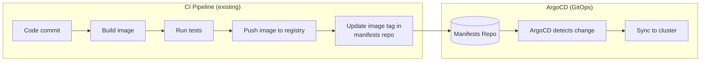

# Reference: Closing the Loop — CI with GitHub Actions

> **Status: not a numbered module.** Per the current syllabus, CI is covered inside the **Capstone** project instead of its own standalone module. This doc is kept as reference material — the underlying pipeline (`webapp/.github/workflows/dashboard-image.yml`), the `VERSION`-file convention, and `arsr319/finovra-dashboard:2.0.0` (the "What's New" panel build) all still exist and work, live-verified against the real cluster. Reuse this content when the Capstone module gets written — either directly against Finovra, or adapted for whichever Online Boutique service the Capstone ends up wiring CI to.

**Duration:** 1 hr
**Environment:** `kind` (local)
**Prerequisites:** Finovra deployed via plain YAML, Helm, and Kustomize (Modules 3-4)

---

## Learning Objectives

By the end of this module, you should be able to:
- Explain exactly where CI's responsibility ends and ArgoCD's begins, concretely, not just as a diagram
- Read a GitHub Actions workflow that builds an image, pushes it to Docker Hub, and updates a separate manifests repo
- Set up the repo secrets a cross-repo CI pipeline like this one needs
- Trigger the pipeline for a real dashboard change and watch the entire loop — build, push, tag bump, sync — complete with zero manual Git or `kubectl` involvement

---

## 1. Where CI Ends and GitOps Begins, For Real This Time

Module 1 showed you this diagram before any of it existed:



Everything left of the arrow into `F` is what you're building this module. Everything right of it, you already know — it's the exact same automated sync you set up in Module 3.

The key discipline: **CI never touches the cluster.** It builds, it pushes an image, it edits a file in `gitops` and pushes that — and stops. ArgoCD picks it up from there, on its own schedule, the same way it always has.

---

## 2. Fork `webapp` Now

Everything up to this point only had you editing `gitops`. This module is the first time you'll push to **`webapp`** — the repo with Finovra's actual source code.

**Fork it:** open https://github.com/finovra-app/webapp and click **Fork**, then clone your fork locally. You should already have `gitops` forked from Module 3 — you'll need write access to both for this module.

---

## 3. The Workflow, Piece by Piece

Your fork of `webapp` already has `.github/workflows/dashboard-image.yml` — you don't write this from scratch, but it's worth understanding every step before you trigger it.

```yaml
on:
  push:
    branches: [main]
    paths:
      - "services/dashboard/**"
```

**It only triggers on changes under `services/dashboard/`.** Push a change to `accounts-service` and nothing happens — this pipeline is scoped to the one service that actually gets new versions.

```yaml
- name: Read version
  id: version
  run: echo "version=$(cat services/dashboard/VERSION)" >> "$GITHUB_OUTPUT"
```

**The tag comes from a file, not a guess.** `services/dashboard/VERSION` is the single source of truth for "what version am I building" — bump that file, and everything downstream (the image tag, the `VERSION` env var in the manifest) follows from it.

```yaml
- name: Build and push dashboard image
  uses: docker/build-push-action@v5
  with:
    context: services/dashboard
    push: true
    tags: ${{ secrets.DOCKERHUB_USERNAME }}/finovra-dashboard:${{ steps.version.outputs.version }}
```

**Ordinary Docker build and push** — the same `docker build`/`docker push` you've run by hand all course, just running inside GitHub's infrastructure instead of your laptop.

```yaml
- name: Bump image tag in gitops repo
  run: |
    git clone "https://x-access-token:${{ secrets.GITOPS_PAT }}@github.com/${{ github.repository_owner }}/gitops.git" gitops-checkout
    cd gitops-checkout
    sed -i "s|image: .*/finovra-dashboard:.*|image: ${DOCKERHUB_USERNAME}/finovra-dashboard:${VERSION}|" k8s/plain-manifests/dashboard/deployment.yaml
    sed -i "/name: VERSION/{n;s|value: \".*\"|value: \"${VERSION}\"|}" k8s/plain-manifests/dashboard/deployment.yaml
    git commit -am "ci: bump dashboard to ${VERSION}"
    git push
```

**This is the entire "update the manifests repo" step from the diagram**, done with `sed` — no templating tool needed for a two-line edit. `${{ github.repository_owner }}` resolves to *your* GitHub username automatically, so this clones and pushes to *your* `gitops` fork, not the upstream one. Notice what this step does **not** do: no `kubectl`, no `argocd`. Its only job is a Git commit.

---

## 4. Setting Up the Three Secrets

This pipeline needs credentials it doesn't have by default — none of these are optional:

| Secret | What it's for | Where to get it |
|---|---|---|
| `DOCKERHUB_USERNAME` | Which Docker Hub account to push to | Your Docker Hub username |
| `DOCKERHUB_TOKEN` | Auth for the push | hub.docker.com → Account Settings → Security → **New Access Token** (not your password) |
| `GITOPS_PAT` | Write access to your `gitops` fork from a different repo's workflow | github.com → Settings → Developer settings → Personal access tokens → generate one scoped to your `gitops` fork with **Contents: Read and write** |

Add all three in your `webapp` fork: **Settings → Secrets and variables → Actions → New repository secret**.

> **Why a PAT and not the built-in `GITHUB_TOKEN`?** GitHub Actions' automatic token only has permissions inside the repo the workflow is running in. Pushing to a *different* repo (`gitops`) needs a token you generate yourself with explicit access to it.

---

## Lab: Ship v2.0.0 Through CI

### Step 1 — Add the changelog panel

In your `webapp` fork, open `services/dashboard/public/index.html`. Add a collapsible panel right after the tiles `<div>`:

```html
<main class="p-6">
  <div id="tiles" class="grid grid-cols-1 sm:grid-cols-2 lg:grid-cols-3 gap-4"></div>

  <details class="max-w-3xl mt-6 rounded-xl border border-slate-800 bg-slate-800/40 p-4">
    <summary class="cursor-pointer text-sm font-semibold text-slate-300">What's New</summary>
    <ul id="changelog" class="mt-3 space-y-1 text-sm text-slate-400"></ul>
  </details>
</main>
```

Then, inside the existing `<script>` block, add the changelog data and a render function:

```js
const CHANGELOG = [
  { version: "2.0.0", note: "Added this What's New panel." },
  { version: "1.0.0", note: "Initial release — all four tiles live." },
];

function renderChangelog() {
  document.getElementById("changelog").innerHTML = CHANGELOG
    .map((entry) => `<li><span class="text-slate-200 font-medium">v${entry.version}</span> — ${entry.note}</li>`)
    .join("");
}
```

Finally, call it alongside the existing `refreshTiles()` call at the bottom of the script:

```js
renderChangelog();
refreshTiles();
setInterval(refreshTiles, POLL_INTERVAL_MS);
```

### Step 2 — Bump the version

Edit `services/dashboard/VERSION`:

```
2.0.0
```

### Step 3 — Commit and push

```bash
git add services/dashboard
git commit -m "Add What's New changelog panel"
git push origin main
```

### Step 4 — Watch the pipeline run

Open your `webapp` fork on GitHub → **Actions** tab. You should see "Build and Deploy Dashboard" running. Watch it through all four steps — checkout, read version, Docker login, build+push, then the `gitops` bump. The whole thing takes a couple of minutes, most of it the Docker build.

### Step 5 — Confirm the image landed

```bash
curl -s "https://hub.docker.com/v2/repositories/<your-dockerhub-username>/finovra-dashboard/tags?page_size=5" | grep -o '"name":"[^"]*"'
```

`2.0.0` should be in the list.

### Step 6 — Confirm the commit landed in your `gitops` fork

Check your `gitops` fork's commit history on GitHub — you should see a new commit authored by `github-actions[bot]`: `ci: bump dashboard to 2.0.0`. Open `k8s/plain-manifests/dashboard/deployment.yaml` and confirm the image tag and `VERSION` env var both read `2.0.0`.

### Step 7 — Watch ArgoCD deploy it

You never touched `kubectl` or `argocd` this entire lab. Just watch:

```bash
argocd app get finovra
kubectl get pods -n finovra -w
```

Within ArgoCD's usual reconciliation window (or hit refresh), `dashboard`'s Pod rolls over to the new image. Once it's `1/1 Running` again:

```bash
kubectl port-forward svc/dashboard -n finovra 8082:3000
```

Open **http://localhost:8082** — the header reads **v2.0.0**, and there's a new **"What's New"** panel below the tiles. Click it open and confirm both changelog entries render.

**Checkpoint:** you wrote a code change, pushed it to `webapp`, and every subsequent step — image build, registry push, manifests update, cluster sync — happened without you running a single `docker`, `kubectl`, or `argocd` command yourself.

---

## Key Terms Glossary

| Term | Meaning |
|---|---|
| **Repo secret** | An encrypted value stored on a GitHub repo, injected into workflow runs as an environment variable — never visible in logs |
| **`GITHUB_TOKEN`** | The token GitHub Actions auto-generates per run; scoped only to the repo the workflow lives in |
| **Personal Access Token (PAT)** | A token you generate yourself, scoped to whatever repos/permissions you choose — needed here to reach across from `webapp` to `gitops` |
| **`docker/build-push-action`** | The official GitHub Action wrapping `docker build` + `docker push` |
| **CI/CD boundary** | The line this whole module is about: CI builds and pushes; it edits a manifests repo; it never touches the cluster directly |

---

## Recap Questions

1. Why does the workflow only trigger on changes under `services/dashboard/`, and not the whole repo?
2. What would happen if you granted the pipeline a Docker Hub token but skipped setting up `GITOPS_PAT` — which step would fail, and why?
3. The "bump image tag" step never runs `kubectl` or `argocd`. What actually causes the new dashboard version to reach your cluster?
4. Why does `services/dashboard/VERSION` matter more than it looks like it should for a one-line text file?

---

## Where This Fits Now

This content isn't currently slotted into a numbered module — see the status note at the top. The required path continues straight from Module 4 into **Module 5: Rollbacks & Failure Recovery**, which deploys a deliberately broken dashboard release (`1.0.1`, the practice-bad build already on Docker Hub) and recovers from it three different ways: native ArgoCD rollback, `git revert`, and pausing reconciliation during an incident.
